# ESPHome Remote Control

Replacement firmware for [Pawel Lugowksi's ESPHome OLED Remote Control](https://tech.lugowski.dev/guides/smart-oled-remote-esphome/). The hardware is built around an ESP32 Lolin32 WROOM (WIFI + Bluetooth) board, a 1.3-inch SH1106 128x64 OLED display, and physical buttons that provide a compact, battery-friendly UI for controlling Home Assistant entities directly from the handheld remote. 

The firmware has been entirely rewritten from scratch based on a newly designed codebase and architecture. It is designed to let you cycle through Home Assistant entities directly from the remote without needing a touchscreen or a phone. The project supports lights, switches, climate devices, humidifiers, fans, covers, locks, media players, sensors, automations, alarms, notifications, weather, and info screens.

## Gallery

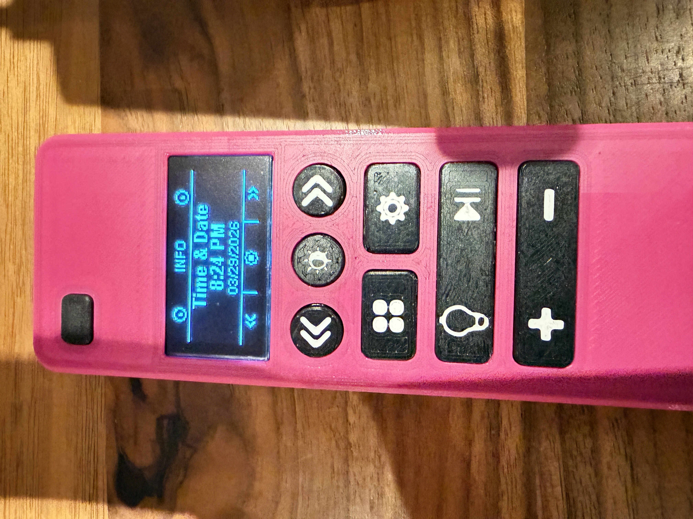

## Remote UI Screenshots

| 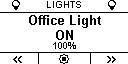 | 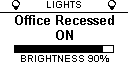 | 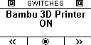 | 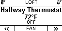 | 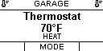 |
| :---: | :---: | :---: | :---: | :---: |
| 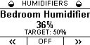 | 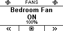 | 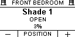 | 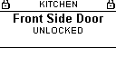 | 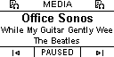 <tr></tr> | 
| 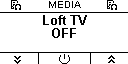 | 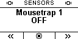 | 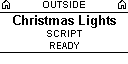 | 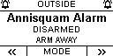 | 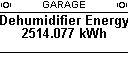 <tr></tr> |
| 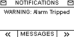 | 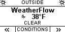 | 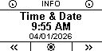 | 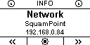 | 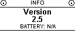 <tr></tr> |

## Features

- Button-driven UI optimized for a 128x64 monochrome OLED
- Deep sleep support for battery-powered remotes
- Multiple board package options for different PCB revisions
- Mode-based navigation across Home Assistant entity types
- Automatic hiding of modes with empty entity lists
- Persistent restore of the current mode, selected entity, contrast, fan selection, and humidifier selection
- Notification, weather, version, time/date, and network info screens
- Optional framebuffer download endpoint for capturing clean UI screenshots

## Supported Modes

- Lights
- Switches
- Climate
- Humidifiers
- Fans
- Covers
- Locks
- Media players
- Sensors
- Automations / scripts / scenes
- Alarms
- Notifications
- Weather
- Info

## Hardware

This configuration is built around:

- ESP32 Lolin32 WROOM (WIFI + Bluetooth) development board
- 1.3-inch SH1106 128x64 OLED display over I2C
- Remote PCB designed by Pawel Lugowski
- Physical navigation and action buttons
- 3D Printed Case and Buttons

Board-specific wiring is selected through the package include in [`src/remote_main.yaml`](src/remote_main.yaml):

- `pcb_proto.yaml`
  Prototype / older board mapping
- `pcb_rev31.yaml`
  Revision 3.1 mapping with OLED power control and battery monitoring

## Repo Layout

```text
esphome_remote/
├── LICENSE
├── README.md
├── home_assistant/
│   └── remote_notifications.yaml
├── images/
│   ├── remote_*.jpeg
│   └── remote_UI-*.png
└── src/
    ├── entity_helpers_common.h
    ├── entity_helpers.h
    ├── entity_helpers_requests.h
    ├── framebuffer_web_debug.cpp
    ├── framebuffer_web_debug.h
    ├── fonts/
    │   └── arial-bold.ttf
    ├── local_entities-example.h
    ├── remote_main.yaml
    ├── packages/
    │   ├── remote_display.yaml
    │   ├── remote_inputs.yaml
    │   └── remote_runtime.yaml
    ├── pcb_proto.yaml
    ├── pcb_rev31.yaml
    └── secrets-example.yaml
```

## Important Files

- `src/remote_main.yaml`
  Main ESPHome entrypoint that pulls together the board package, shared packages, secrets, and local entity definitions.
- `src/entity_helpers.h`
  Shared C++ helper declarations used by the display and control logic.
- `src/entity_helpers_common.h` and `src/entity_helpers_requests.h`
  Split helper implementations for shared entity metadata/state logic and Home Assistant request helpers.
- `src/local_entities.h`
  Your private Home Assistant entity definitions. This file is ignored by Git.
- `src/local_entities-example.h`
  Example entity lists you can copy and customize.
- `src/packages/`
  Modular ESPHome packages for runtime behavior, button/input handling, and display/UI rendering.
- `src/framebuffer_web_debug.cpp` and `src/framebuffer_web_debug.h`
  Optional debug-only PBM framebuffer export for screenshot capture.
- `home_assistant/remote_notifications.yaml`
  Optional Home Assistant template sensor bridge for the Notifications mode.

## 1. Install ESPHome

Follow the official directions on the [ESPHome website](https://esphome.io/guides/installing_esphome/).

If you're using MacOS, the easiest way to install is via [Homebrew](https://brew.sh/) by running this command in a MacOS terminal window:
```bash
/bin/bash -c "$(curl -fsSL https://raw.githubusercontent.com/Homebrew/install/HEAD/install.sh)"
```

Now install ESPHome:
```bash
brew install esphome
```

## 2. Clone The Repository

```bash
git clone https://github.com/kedube/esphome_remote
cd esphome_remote
```

## 3. Create Your Secrets File

Copy the example secrets file:

```bash
cp src/secrets-example.yaml src/secrets.yaml
```

Then fill in your Wi-Fi, OTA, and API encryption details:

```yaml
wifi_ssid: "YourWiFiName"
wifi_password: "YourWiFiPassword"
encryption_key: "YourESPHomeAPIKey"
ota_password: "YourOTAPassword"
```

## 4. Create Your Entity List

Copy the example entity file:

```bash
cp src/local_entities-example.h src/local_entities.h
```

Edit `src/local_entities.h` so it matches your Home Assistant setup.

The example file supports these lists:

- `LIGHT_LIST`
- `SWITCH_LIST`
- `CLIMATE_LIST`
- `HUMIDIFIER_LIST`
- `FAN_LIST`
- `COVER_LIST`
- `LOCK_LIST`
- `MEDIA_PLAYER_LIST`
- `SENSOR_LIST`
- `AUTOMATION_LIST`
- `ALARM_LIST`
- `WEATHER_LIST`

You can leave any list empty. Empty lists compile cleanly, and their corresponding modes are automatically hidden from the remote UI.

_Example:_

```cpp
static const LightEntity LIGHT_LIST[] = {
    {"Living Room Lamp", "light.living_room_lamp"},
};

static const MediaEntity MEDIA_PLAYER_LIST[] = {
    {"Bedroom TV", "media_player.bedroom_tv"},
    {"Receiver", "media_player.receiver", "Apple TV|PlayStation|Switch"},
};
```

Minimal empty-list example:

```cpp
static const AlarmEntity ALARM_LIST[] = {};
static const WeatherEntity WEATHER_LIST[] = {};
```

Notifications are configured in the same file with optional feed defines:

```cpp
#define NOTIFICATION_FEED_ENTITY "sensor.remote_notifications"
#define NOTIFICATION_FEED_ATTRIBUTE "messages"
#define NOTIFICATION_FEED_IDS_ATTRIBUTE "ids"
#define NOTIFICATION_FEED_SEPARATOR "||"
```

Notes:

- Set `NOTIFICATION_FEED_ENTITY` to an empty string to hide Notifications mode completely.
- `NOTIFICATION_FEED_ENTITY` is the Home Assistant entity the remote reads from.
- `NOTIFICATION_FEED_ATTRIBUTE` is the attribute on that entity containing the notification payload.
- `NOTIFICATION_FEED_IDS_ATTRIBUTE` is the attribute on that entity containing notification IDs for dismiss actions.
- `NOTIFICATION_FEED_SEPARATOR` is used when multiple notifications are packed into one string.

If Home Assistant no longer exposes a ready-made `sensor.persistent_notifications`, add the included template sensor on the Home Assistant side to recreate the feed the remote expects.

Copy [`home_assistant/remote_notifications.yaml`](home_assistant/remote_notifications.yaml) into your Home Assistant `template:` configuration, or include it as a package. It publishes:

- `sensor.remote_notifications`
- state = current notification count
- attribute `messages` = all active persistent notifications packed into one `||`-separated string
- attribute `ids` = matching persistent notification IDs packed in the same order

This bridge is event-driven. It listens for Home Assistant `persistent_notification` updates, stores the active notification list in the template sensor’s own attributes, and exposes a `messages` attribute that the remote can read. Each item is emitted as `Title: Message`, with newlines flattened to spaces so the remote can render them cleanly.

In Notifications mode, pressing the circle or play/pause action button dismisses the currently selected persistent notification. The display shows `DISMISSED` for 3 seconds, then refreshes and advances to the next remaining notification.

## 5. Select The Correct PCB Package

Open `src/remote_main.yaml` and choose the board package that matches your hardware:

```yaml
packages:
  select_pcb: !include
    file: pcb_proto.yaml
    # file: pcb_rev31.yaml
```

## 6. Validate The Configuration

```bash
esphome config src/remote_main.yaml
```

## 7. Build And Flash

```bash
esphome run src/remote_main.yaml
```

You must connect the remote via USB to your computer in order to perform the first flash. It will prompt you after a successful built for where to upload the code. After the first flash, future updates can be done over OTA.

```INFO Build Info: config_hash=0x694d2e36 build_time_str=2026-04-01 14:02:17 -0400
INFO Successfully compiled program.
Found multiple options for uploading, please choose one:
  [1] /dev/cu.usbserial-8320 (USB Serial)
  [2] Over The Air (esp32-remote.local)
(number):```

## Optional Framebuffer Download Debugging

If you want clean screenshots of the OLED UI, the project can expose the current framebuffer as a downloadable PBM image.

Enable the framebuffer debug flag in [`src/remote_main.yaml`](src/remote_main.yaml):

```yaml
substitutions:
  FRAMEBUFFER_WEB_DEBUG: "1"
```

Then uncomment the web server section in the same file:

```yaml
web_server:
  port: 80
```

You can also use a CLI substitution override:

```bash
esphome -s FRAMEBUFFER_WEB_DEBUG 1 config src/remote_main.yaml
esphome -s FRAMEBUFFER_WEB_DEBUG 1 run src/remote_main.yaml
```

After flashing, browse to:

- `http://<device-ip>/debug/framebuffer.pbm`

Notes:

- The framebuffer download endpoint is off by default.
- If `FRAMEBUFFER_WEB_DEBUG` is enabled but `web_server:` remains commented out, the URL will not be reachable.
- The PBM image is generated from the live OLED framebuffer.
- This is mainly intended for debugging and README screenshots.

## UI Notes

- The remote restores the previously selected mode and item after wake or reboot.
- Fan and humidifier selections are also persisted.
- Modes with no configured entities are skipped automatically.
- Lock, cover, and automation actions use long-press protection.
- Circle is the primary action button. Play/pause is the alternate action button.
- In Locks mode, circle locks and play/pause unlocks. The remote shows temporary detail-line feedback such as `LOCKING...`, `UNLOCKING...`, `LOCKED`, `UNLOCKED`, `JAMMED`, `ALREADY LOCKED`, and `ALREADY UNLOCKED`.
- In Covers mode, circle opens and play/pause closes. The remote shows temporary detail-line feedback such as `OPENING...`, `CLOSING...`, `OPENED`, `CLOSED`, and `OPEN xx%`.
- In Automations mode, automations, scripts, and scenes show temporary feedback such as `TRIGGERING...`, `ACTIVATING...`, `RUNNING...`, `TRIGGERED`, `ACTIVATED`, `STARTED`, and `COMPLETED`.
- Info mode includes Time & Date, Network, and Version screens.
- Notification mode reads from `NOTIFICATION_FEED_ENTITY` in `src/local_entities.h`.

## Supported Home Assistant Entity Domains

- `light.*`
- `switch.*`
- `climate.*`
- `humidifier.*`
- `fan.*`
- `cover.*`
- `lock.*`
- `media_player.*`
- `sensor.*`
- `binary_sensor.*`
- `automation.*`
- `script.*`
- `scene.*`
- `alarm_control_panel.*`
- `weather.*`

## Important Settings

These substitutions near the top of `src/remote_main.yaml` are the main things you may want to customize:

- `TEMPERATURE_UNIT`
  Set to `"F"` or `"C"` to match your Home Assistant climate values.
- `SLEEP_DURATION`
  Idle time before the remote sleeps.
- `DEEP_SLEEP_DURATION`
  Duration of deep sleep.
- `LONG_PRESS_DURATION_MS`
  Hold time for protected actions.
- `LOW_BATTERY_VOLTAGE`
  Battery warning threshold for battery-monitoring boards.
- `PIN_*`
  Button, wake, and I2C pin assignments.

## Troubleshooting

### `local_entities.h` is missing

Create it from the example file:

```bash
cp src/local_entities-example.h src/local_entities.h
```

### `secrets.yaml` is missing

Create it from the example file:

```bash
cp src/secrets-example.yaml src/secrets.yaml
```

### A mode does not appear in the menu

That usually means the corresponding entity list is empty. Empty modes are intentionally hidden.

### A Home Assistant entity does not respond

Ensure there are no typos in the entity name. You can check the list of entity names from __Home Assistant->Settings->Developer Tools->Template__. In the Template editor, use this example (replace 'light' with the entity domain you'd like to search):

```yaml

{{ e.entity_id }}

```

### The framebuffer download URL does not work

Make sure both of these are true:

- `FRAMEBUFFER_WEB_DEBUG: "1"` is set in `src/remote_main.yaml`
- `web_server:` is uncommented in `src/remote_main.yaml`

### ESPHome compile or upload fails

Start with:

```bash
esphome config src/remote_main.yaml
```

If validation succeeds, retry with:

```bash
esphome run src/remote_main.yaml
```

## Related Links

- [ESPHome OLED remote control project article](https://tech.lugowski.dev/guides/smart-oled-remote-esphome/)
- [Etsy store for buying PCBs or Full Remotes](https://www.etsy.com/listing/4390635949/home-assistant-esphome-oled-remote)
- [MakerWorld case files](https://makerworld.com/en/models/1902607-home-assistant-esphome-remote-with-oled-display)
