# ESPHome Remote Control

Replacement firmware for [Pawel Lugowski's ESPHome OLED Remote Control](https://tech.lugowski.dev/guides/smart-oled-remote-esphome/). The hardware is built around an ESP32 Lolin32 WROOM (WIFI + Bluetooth) board, a 1.3-inch SH1106 128x64 OLED display, and physical buttons that provide a compact, battery-friendly UI for controlling Home Assistant entities directly from the handheld remote. 

The firmware has been entirely rewritten from scratch based on a newly designed codebase and architecture. It is designed to let you cycle through Home Assistant entities directly from the remote without needing a touchscreen or a phone. The remote now uses mixed-entity favorite lists as the primary navigation model, while still supporting controls for lights, switches, climate devices, humidifiers, fans, covers, locks, media players, sensors, automations, alarms, weather, notifications, and info screens.

## Gallery

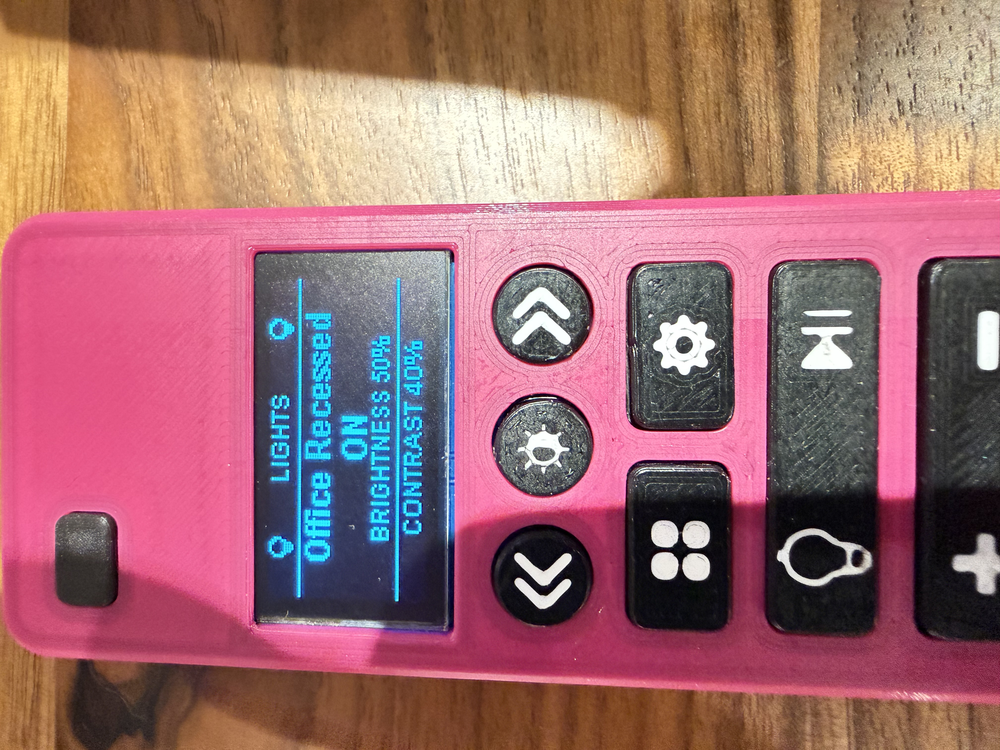

## Remote UI Screenshots

| 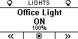 | 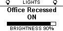 | 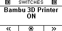 | 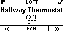 | 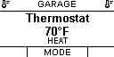 |
| :---: | :---: | :---: | :---: | :---: |
| 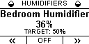 | 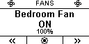 | 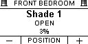 | 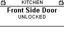 | 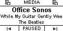 <tr></tr> | 
| 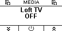 |  | 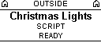 | 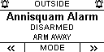 | 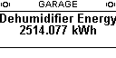 <tr></tr> |
| 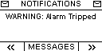 | 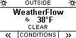 | 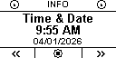 | 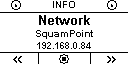 | 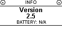 <tr></tr> |

## Features

- Button-driven UI optimized for a 128x64 monochrome OLED
- Deep sleep support for battery-powered remotes
- Multiple board package options for different PCB revisions
- Favorite-list navigation with mixed Home Assistant entity types in each list
- Automatic hiding of empty favorite lists and optional Notifications mode
- Persistent restore of the current menu, selected item, contrast, and lightweight mode-selection UI state after wake or reboot
- Notification, weather, and detailed info screens for time/date, wireless, network, device name, battery, and version
- Optional framebuffer download endpoint for capturing clean UI screenshots

## Quick Start

If you just want to get the remote running:

1. Install ESPHome.
2. Copy [`esphome/examples/secrets-example.yaml`](esphome/examples/secrets-example.yaml) to [`esphome/secrets.yaml`](esphome/secrets.yaml) and fill in your Wi-Fi, OTA, and API credentials.
3. Copy [`esphome/examples/local_entities-example.h`](esphome/examples/local_entities-example.h) to [`esphome/local_entities.h`](esphome/local_entities.h) and define your favorite lists.
4. Open [`esphome/settings.yaml`](esphome/settings.yaml) and choose the correct PCB package.
5. Run `esphome run esphome/remote_control.yaml`.

## Navigation Model

- One or more user-defined favorite lists containing mixed entity types
- Optional Notifications screen after the favorite lists
- Info screen always available at the end of the menu

Each favorite list shows the list name in the header, the selected entry name in the main title row, and the current entity domain icon in the corners. The control surface adapts automatically to the selected entity type.

## Hardware

This configuration is built around:

- ESP32 Lolin32 WROOM (WIFI + Bluetooth) development board
- 1.3-inch SH1106 128x64 OLED display over I2C
- Remote PCB designed by Pawel Lugowski
- Physical navigation and action buttons
- 3D Printed Case and Buttons

Board-specific wiring is selected through the PCB package include in [`esphome/settings.yaml`](esphome/settings.yaml).

### ESP32 chip revision

[`esphome/remote_control.yaml`](esphome/remote_control.yaml) sets
`minimum_chip_revision: "3.0"`. ESP32 boards ship with different silicon revisions, and
the bootloader refuses any firmware built for a revision newer than the chip it is
running on. That check happens when an update is *finalized*, so a mismatch shows up as
an OTA that transfers to 100% and then fails, rather than as a build error.

If you flash a board older than rev 3.0, lower this value to match. The revision is
printed at boot:

```bash
esphome logs esphome/remote_control.yaml
# [I][app]: ESP32 Chip: ESP32 rev3.0, 2 core(s)
```

`esphome/remote_control.yaml` includes that shared settings file, while [`esphome/settings.yaml`](esphome/settings.yaml) contains the common substitutions, PCB package selection, and optional `web_server` block.

Please refer to the [Quick Start Guide](https://tech.lugowski.dev/smart-remote-kit/) for more details:

- `esphome/packages/pcb_rev1.yaml`
  Revision 1 board mapping (no OLED power control or battery monitoring)
- `esphome/packages/pcb_rev2.yaml`
  Revision 2 board mapping with battery monitoring (no OLED power control)
- `esphome/packages/pcb_rev31.yaml`
  Revision 3.1 mapping with OLED power control and battery monitoring

## Repo Layout

```text
esphome_remote/
├── .github/
│   ├── ISSUE_TEMPLATE/
│   │   ├── bug_report.yml
│   │   ├── config.yml
│   │   └── feature_request.yml
│   ├── scripts/
│   │   ├── bump_version.py
│   │   ├── generate_release_notes.py
│   │   ├── prepare_ci_config.py
│   │   ├── read_version.py
│   │   └── update_changelog.py
│   ├── workflows/
│   │   ├── ci.yml
│   │   └── release.yml
│   └── release.yml
├── .vscode/
│   ├── c_cpp_properties.json
│   ├── extensions.json
│   ├── launch.json
│   └── settings.json          # gitignored; yours is local-only
├── .yamllint.yml
├── CHANGELOG.md
├── LICENSE
├── README.md
├── requirements.txt
├── assets/
│   └── fonts/
│       └── arial-bold.ttf
├── esphome/
│   ├── .gitignore
│   ├── examples/
│   │   ├── local_entities-example.h
│   │   └── secrets-example.yaml
│   ├── packages/
│   │   ├── pcb_rev1.yaml
│   │   ├── pcb_rev2.yaml
│   │   ├── pcb_rev31.yaml
│   │   ├── remote_actions_automation.yaml
│   │   ├── remote_actions_climate_media.yaml
│   │   ├── remote_actions_devices.yaml
│   │   ├── remote_actions_feedback.yaml
│   │   ├── remote_actions_security.yaml
│   │   ├── remote_button_action_scripts.yaml
│   │   ├── remote_button_press_scripts.yaml
│   │   ├── remote_display_runtime_globals.yaml
│   │   ├── remote_display_scripts.yaml
│   │   ├── remote_display_selection_globals.yaml
│   │   ├── remote_display_state_globals.yaml
│   │   ├── remote_fonts.yaml
│   │   ├── remote_inputs.yaml
│   │   ├── remote_runtime.yaml
│   │   ├── remote_ui_navigation_actions.yaml
│   │   ├── remote_ui_selection_scripts.yaml
│   │   └── remote_ui_setup_scripts.yaml
│   ├── local_entities.h
│   ├── remote_control.yaml
│   ├── secrets.yaml
│   └── settings.yaml
├── home_assistant/
│   └── remote_notifications.yaml
├── include/
│   ├── entity_helpers_common.h
│   ├── entity_helpers.h
│   ├── entity_helpers_requests.h
│   ├── entity_trackers.h
│   ├── framebuffer_web_debug.h
│   ├── local_entities.h
│   ├── remote_ui_bindings.h
│   ├── remote_ui_feedback.h
│   ├── remote_ui_input_logic.h
│   ├── remote_ui_logic.h
│   ├── remote_ui_renderer.h
│   ├── remote_ui_runtime.h
│   ├── remote_ui_sync.h
│   └── ui_state_helpers.h
├── images/
│   ├── remote_*.jpeg
│   └── remote_UI-*.png
├── platformio.ini
├── src/
│   ├── framebuffer_web_debug.cpp
│   ├── remote_ui_feedback.cpp
│   ├── remote_ui_input_logic.cpp
│   ├── remote_ui_logic.cpp
│   ├── remote_ui_renderer.cpp
│   ├── remote_ui_runtime.cpp
│   └── remote_ui_sync.cpp
└── tools/
    └── pio_esphome_bridge.py
```

## Important Files

- `esphome/remote_control.yaml`
  Main ESPHome entrypoint that pulls together shared packages, secrets, local entity definitions, fonts, and runtime logic.
- `esphome/settings.yaml`
  Shared configuration file for common substitutions, PCB selection, and optional web server settings.
- `include/entity_helpers.h`
  Compatibility shim that includes the tracker and request helper layers.
- `include/entity_trackers.h`
  Home Assistant tracker classes that subscribe to and cache entity state.
- `include/entity_helpers_common.h` and `include/entity_helpers_requests.h`
  Shared entity metadata/state helpers and the request/query layer built on top of the trackers.
- `esphome/local_entities.h`
  Your private Home Assistant entity definitions and favorite lists. This file is ignored by Git and lives next to `secrets.yaml` for a simpler compile workflow.
- `esphome/examples/local_entities-example.h`
  Example entity definitions and favorite lists you can copy and customize.
- `include/local_entities.h`
  Compatibility shim that forwards to `esphome/local_entities.h`.
- `esphome/packages/`
  Modular ESPHome packages for actions, button/input handling, runtime behavior, display globals, fonts, and UI scripts.
- `src/framebuffer_web_debug.cpp` and `include/framebuffer_web_debug.h`
  Optional debug-only PBM framebuffer export for screenshot capture.
- `platformio.ini` and `tools/pio_esphome_bridge.py`
  Root PlatformIO wrapper that delegates the IDE build button and `pio run` to the ESPHome toolchain.
- `home_assistant/remote_notifications.yaml`
  Optional Home Assistant template sensor bridge for the Notifications mode.

## Architecture Notes

- `include/entity_helpers_common.h`
  Shared metadata, favorite-list plumbing, internal domain indexing, selection helpers, and configuration validation.
- `include/entity_trackers.h`
  Home Assistant tracker classes that subscribe to and cache entity state.
- `include/entity_helpers_requests.h`
  Thin request/sync helpers that bridge tracker state into the UI logic.
- `include/remote_ui_bindings.h`
  Shared UI binding helpers used to build reset/sync state objects without duplicating YAML wiring blocks.
- `include/ui_state_helpers.h`
  Persistent UI save/restore helpers for menu, selection, and lightweight mode state.
- `esphome/remote_control.yaml`
  Top-level composition file that imports the modular ESPHome packages and C++ helpers.

The `esphome/packages/` folder is currently split by responsibility:

- `remote_actions_*.yaml`
  Entity actions and feedback flows grouped by domain.
- `remote_button_*.yaml`
  Button press handling and action wrapper scripts.
- `remote_display_*.yaml`
  Display hardware, UI globals, and the render entry script.
- `remote_fonts.yaml`
  Font definitions, including the weather icon font.
- `remote_ui_*.yaml`
  UI setup, selection, and navigation scripts.
- `remote_inputs.yaml` and `remote_runtime.yaml`
  Physical input bindings and the runtime loop.

At startup the remote validates the configured favorite entries and logs warnings for missing names, missing entity IDs, or unsupported entity domains.

## 1. Install ESPHome

Follow the official directions on the [ESPHome website](https://esphome.io/guides/installing_esphome/).

If you're using MacOS, the easiest way to install is via [Homebrew](https://brew.sh/) by running this command in a MacOS terminal window:
```bash
/bin/bash -c "$(curl -fsSL https://raw.githubusercontent.com/Homebrew/install/HEAD/install.sh)"
```

Now install ESPHome:
```bash
brew install esphome
```

## 2. Clone The Repository

```bash
git clone https://github.com/kedube/esphome_remote
cd esphome_remote
```

## 3. Create Your Secrets File

Copy the example secrets file:

```bash
cp esphome/examples/secrets-example.yaml esphome/secrets.yaml
```

Then fill in your Wi-Fi, OTA, and API encryption details:

```yaml
wifi_ssid: "YourWiFiName"
wifi_password: "YourWiFiPassword"
encryption_key: "YourESPHomeAPIKey"
ota_password: "YourOTAPassword"
alarm_code: ""
```

`alarm_code` is optional. Leave it empty unless your alarm integration requires a code (see the alarm notes in step 5).

## 4. Create Your Favorite Lists

Copy the example favorite-list file:

```bash
cp esphome/examples/local_entities-example.h esphome/local_entities.h
```

Edit `esphome/local_entities.h` so it matches your Home Assistant setup.

The file now only needs favorite lists. Each `FavoriteEntity` entry provides a display name and a Home Assistant `entity_id`, and the remote infers the entity type from the `entity_id` prefix such as `light.`, `switch.`, `climate.`, `weather.`, and so on.

You can define as many favorite lists as you want. Empty favorite lists compile cleanly and are skipped automatically in the menu.

_Example:_

```cpp
inline constexpr FavoriteEntity MAIN_FAVORITES[] = {
  {"Living Room Lamp", "light.living_room_lamp"},
  {"Bedroom TV", "media_player.bedroom_tv"},
  {"Main Thermostat", "climate.main_thermostat"},
  {"Front Door", "lock.front_door"},
};

inline constexpr FavoriteList FAVORITE_LISTS[] = {
  make_favorite_list("MAIN", MAIN_FAVORITES),
};
```

Minimal multi-list example:

```cpp
inline constexpr FavoriteEntity UPSTAIRS_FAVORITES[] = {
  {"Hallway Thermostat", "climate.hallway_thermostat"},
  {"Bedroom Fan", "fan.bedroom_fan"},
};

inline constexpr FavoriteEntity OUTDOOR_FAVORITES[] = {};

inline constexpr FavoriteList FAVORITE_LISTS[] = {
  make_favorite_list("UPSTAIRS", UPSTAIRS_FAVORITES),
  make_favorite_list("OUTDOOR", OUTDOOR_FAVORITES),
};
```

### Media player sources (optional third field)

A favorite entry accepts an optional third field listing selectable sources, separated
by `|`:

```cpp
inline constexpr FavoriteEntity LIVING_ROOM_FAVORITES[] = {
  {"Speaker", "media_player.living_room_speaker", "Spotify|Radio|Line In"},
};
```

The remote resolves a media player's source list like this:

- **TVs and receivers** (Home Assistant `device_class` of `tv` or `receiver`) use the
  live `source_list` reported by Home Assistant, and ignore this field.
- **Every other media player** uses the sources you list here. Home Assistant does not
  reliably expose a usable `source_list` for those, so without this field the remote has
  nothing to cycle and the `SOURCE` setting does not appear.

Source names must not contain a `|`, since that is the separator. A name written here
that contains one is silently split into two entries, so pick names without it. (Source
names arriving from Home Assistant for a TV or receiver are checked and skipped with a
warning instead.)

Notifications are configured in the same file with optional feed defines:

```cpp
#define NOTIFICATION_FEED_ENTITY "sensor.remote_notifications"
#define NOTIFICATION_FEED_ATTRIBUTE "messages"
#define NOTIFICATION_FEED_IDS_ATTRIBUTE "ids"
#define NOTIFICATION_FEED_SEPARATOR "||"
```

Notes:

- Set `NOTIFICATION_FEED_ENTITY` to an empty string to hide Notifications completely.
- `NOTIFICATION_FEED_ENTITY` is the Home Assistant entity the remote reads from.
- `NOTIFICATION_FEED_ATTRIBUTE` is the attribute on that entity containing the notification payload.
- `NOTIFICATION_FEED_IDS_ATTRIBUTE` is the attribute on that entity containing notification IDs for dismiss actions.
- `NOTIFICATION_FEED_SEPARATOR` is used when multiple notifications are packed into one string.

Since Home Assistant no longer exposes a ready-made `sensor.persistent_notifications`, the included template sensor must be added to Home Assistant to recreate the feed the remote expects.

Copy [`home_assistant/remote_notifications.yaml`](home_assistant/remote_notifications.yaml) into your Home Assistant `template:` configuration, or include it as a package. It publishes:

- `sensor.remote_notifications`
- state = current notification count
- attribute `messages` = all active persistent notifications packed into one `||`-separated string
- attribute `ids` = matching persistent notification IDs packed in the same order

This bridge is event-driven. It listens for Home Assistant `persistent_notification` updates, stores the active notification list in the template sensor’s own attributes, and exposes a `messages` attribute that the remote can read. Each item is emitted as `Title: Message`, with newlines flattened to spaces so the remote can render them cleanly.

In Notifications mode, pressing the circle or play/pause action button dismisses the currently selected persistent notification. The display shows `DISMISSED` for 3 seconds, then refreshes and advances to the next remaining notification.

## 5. Configure `settings.yaml`

Open `esphome/settings.yaml` and update the shared settings for your remote. This is the main file for device-level customization.

Use this file for three things:

1. Select the PCB package that matches your hardware.
2. Set the shared substitutions that control naming, timing, and battery behavior.
3. Enable optional features such as framebuffer web debugging.

Start by choosing the board package that matches your remote hardware PCB:

```yaml
packages:
  select_pcb: !include
    #file: packages/pcb_rev1.yaml
    #file: packages/pcb_rev2.yaml
    file: packages/pcb_rev31.yaml
```

  The same file also contains the most common substitutions you may want to change:

| Setting | Purpose |
| --- | --- |
| `BOARD` | ESPHome board definition, currently `esp32dev`. |
| `DEVICE_NAME` | Network name used by ESPHome and OTA. |
| `FRIENDLY_NAME` | Human-readable device name shown in Home Assistant. |
| `VERSION` | Firmware version label shown on the boot screen and the Info version screen. |
| `NOTIFICATION_FEED_MAX_ITEMS` | Maximum number of notification messages cached and exposed in Notifications mode. |
| `MAX_PERSISTED_FAVORITE_LISTS` | Compile-time capacity limit for configured favorite lists. This must be at least as large as your configured favorite list count. |
| `TEMPERATURE_UNIT` | Set to `"F"` or `"C"` to match your Home Assistant climate values. |
| `SPEED_UNIT` | Wind speed unit label (`"MPH"` or `"KPH"`) shown in the weather wind and gust views. |
| `PRESSURE_UNIT` | Pressure unit label (`"hPa"` or `"kPa"`) shown in the weather pressure view. |
| `PRECIPITATION_UNIT` | Precipitation unit label (`"in"` or `"mm"`) shown in the weather precipitation view. |
| `SLEEP_DURATION` | Idle time before the remote sleeps. |
| `DEEP_SLEEP_DURATION` | Maximum awake time before the remote enters deep sleep. **Do not set this to `0`.** ESPHome reads `0` as "sleep immediately after boot", which makes the remote unusable and OTA updates nearly impossible to land. To disable forced deep sleep, comment out the `deep_sleep:` block in `esphome/remote_control.yaml`, or use a long duration such as `"1440min"`. |
| `LONG_PRESS_DURATION_MS` | Hold time for protected actions. |
| `EXTENDED_HOLD_DURATION_MS` | Shared hold time for long protected actions that use the extended timer, including the Settings button alarm trigger and wake-button reboot. |
| `WAKE_BUTTON_DEBOUNCE_MS` | Debounce time for the wake/power button press and release handling. |
| `NAVIGATION_SYNC_DELAY_MS` | Short quiet period after navigation before subscription-backed state sync resumes. |
| `REBOOT_MESSAGE_DURATION_MS` | How long the `REBOOTING...` message stays on screen before the remote restarts. |
| `ALARM_STATUS_UPDATE_DELAY_MS` | How long `ARMING...` / `DISARMING...` feedback waits before being replaced by the reported alarm state. |
| `SAFE_MODE_BOOT_IS_GOOD_AFTER` | How long a new boot must survive before ESPHome considers it successful for safe mode and OTA rollback. |
| `LOW_BATTERY_VOLTAGE` | Battery warning threshold for battery-monitoring boards. |
| `BATTERY_DIVIDER_MULTIPLIER` | Voltage divider scaling factor for battery-monitoring boards. |
| `BATTERY_VOLTAGE_MIN` | Battery voltage treated as 0% for the percentage estimate. |
| `BATTERY_VOLTAGE_MAX` | Battery voltage treated as 100% for the percentage estimate. |
| `BATTERY_VOLTAGE_CURVE_GAMMA` | Curve shaping factor for the battery percentage estimate. |
| `FRAMEBUFFER_WEB_DEBUG` | Set to `"1"` only when using the optional framebuffer download endpoint. |

Notes:

- `NOTIFICATION_FEED_MAX_ITEMS` and `MAX_PERSISTED_FAVORITE_LISTS` are compile-time capacity limits. Changing them requires recompiling the firmware and may increase memory usage.
- The timing substitutions such as `SLEEP_DURATION`, `LONG_PRESS_DURATION_MS`, `EXTENDED_HOLD_DURATION_MS`, `WAKE_BUTTON_DEBOUNCE_MS`, `NAVIGATION_SYNC_DELAY_MS`, `REBOOT_MESSAGE_DURATION_MS`, `ALARM_STATUS_UPDATE_DELAY_MS`, and `SAFE_MODE_BOOT_IS_GOOD_AFTER` control runtime behavior and are the safest settings to tune first.
- Safe starting points:
  `NOTIFICATION_FEED_MAX_ITEMS: "16"`, `MAX_PERSISTED_FAVORITE_LISTS: "16"`, `WAKE_BUTTON_DEBOUNCE_MS: "30"`, `NAVIGATION_SYNC_DELAY_MS: "250"`, `REBOOT_MESSAGE_DURATION_MS: "2000"`, `SAFE_MODE_BOOT_IS_GOOD_AFTER: "10s"`.

`esphome/remote_control.yaml` includes this shared settings file. The board-specific `PIN_*` substitutions still come from the selected PCB package.

If your alarm integration requires a code, add it to `esphome/secrets.yaml`:

```yaml
alarm_code: "1234"
```

The `ALARM_CODE` substitution is already wired to `!secret alarm_code` in `esphome/remote_control.yaml`, so no other file needs to change. Leave `alarm_code` empty in `esphome/secrets.yaml` if your integration does not use a code — the remote will arm and disarm without one.

## 6. Validate The Configuration

```bash
esphome config esphome/remote_control.yaml
```

## 7. Build And Flash

```bash
esphome run esphome/remote_control.yaml
```

You must connect the remote via USB to your computer in order to perform the first flash. It will prompt you after a successful build for where to upload the code. After the first flash, future updates can be done over OTA.

```text
INFO Build Info: config_hash=0x694d2e36 build_time_str=2026-04-01 14:02:17 -0400
INFO Successfully compiled program.
Found multiple options for uploading, please choose one:
  [1] /dev/cu.usbserial-8320 (USB Serial)
  [2] Over The Air (esphome-remote.local)
(number):
```

### Building From VS Code / PlatformIO IDE

The real PlatformIO project for this firmware is generated by ESPHome under `esphome/.esphome/build/<device>/` and pins its own platform and frameworks, so the root `platformio.ini` does not compile the firmware directly. Instead, its default build target delegates to the ESPHome toolchain through `tools/pio_esphome_bridge.py`. This means the PlatformIO IDE build button just works, as do the equivalent terminal commands:

```bash
pio run                    # runs: esphome compile esphome/remote_control.yaml
pio run -t esphome-upload  # runs: esphome run esphome/remote_control.yaml (build + flash)
```

The `.vscode/` folder ships matching IntelliSense (`c_cpp_properties.json`), extension recommendations, and launch settings for working on the C++ sources in `include/` and `src/`.

## Optional Framebuffer Download Debugging

If you want clean screenshots of the OLED UI, the project can expose the current framebuffer as a downloadable PBM image.

Enable the framebuffer debug flag in [`esphome/settings.yaml`](esphome/settings.yaml):

```yaml
substitutions:
  FRAMEBUFFER_WEB_DEBUG: "1"
```

Then, uncomment the web server section in the same file. The web server has no
authentication unless you add it, so include credentials — without them, anyone
on your network can read the live screen (which can show alarm state, lock
state, and notification text) and toggle any entity the device exposes:

```yaml
web_server:
  port: 80
  auth:
    username: !secret web_server_username
    password: !secret web_server_password
```

You can also use a CLI substitution override:

```bash
esphome -s FRAMEBUFFER_WEB_DEBUG 1 config esphome/remote_control.yaml
esphome -s FRAMEBUFFER_WEB_DEBUG 1 run esphome/remote_control.yaml
```

After flashing, browse to:

- `http://esphome-remote.local/debug/framebuffer.pbm`

Notes:

- The framebuffer download endpoint is off by default.
- If `FRAMEBUFFER_WEB_DEBUG` is enabled but `web_server:` remains commented out, the URL will not be reachable.
- The PBM image is generated from the live OLED framebuffer.
- This is mainly intended for debugging and README screenshots. Re-comment the
  `web_server:` block and set `FRAMEBUFFER_WEB_DEBUG` back to `"0"` when you are
  finished, so the remote is not left serving its screen on your network.

## Button Guide

The remote is designed around ten physical inputs:

| Button | Default behavior |
| --- | --- |
| Wake / Power | Short-press and release puts the remote to sleep. Hold for `EXTENDED_HOLD_DURATION_MS` to reboot. |
| Mode | Cycles to the next top-level mode or favorite list. |
| Previous | Selects the previous item in the current mode. |
| Next | Selects the next item in the current mode. |
| Dimmer | Cycles the OLED contrast level. |
| Settings | Cycles through the available detail/settings views for the current item. In alarm mode, hold for `EXTENDED_HOLD_DURATION_MS` to trigger the alarm; release earlier to cycle views as usual. |
| Minus | Decreases the current adjustable setting. In Weather mode, it cycles backward through detail views. |
| Plus | Increases the current adjustable setting. In Weather mode, it cycles forward through detail views. |
| Circle | Positive or activate action in most modes: turn on, open, lock, play/pause, run, arm, or dismiss. |
| Square | Negative or deactivate action in most modes: turn off, close, unlock, stop, or disarm. |

Common usage pattern:

- Use `Mode` to move between favorite lists, Notifications, and Info.
- Use `Previous` and `Next` to choose an item.
- Use `Settings` to pick which detail or control you want to adjust.
- Use `Plus` and `Minus` to change the selected value or browse weather details.
- Use `Circle` and `Square` for the main action on the current item.

Long-press protection:

- Locks and covers require holding either action button for `LONG_PRESS_DURATION_MS`.
- Automations require holding `Circle` for `LONG_PRESS_DURATION_MS`. `Square` has no action in automation mode.
- Alarm arming and disarming also use long-press protection.
- Alarm trigger on the Settings button and wake-button reboot both use `EXTENDED_HOLD_DURATION_MS`.

## Mode Map

| Mode | Primary actions |
| --- | --- |
| Favorites: Lights | `Circle` on, `Square` off, `Settings` selects brightness/effect when available. |
| Favorites: Switches | `Circle` on, `Square` off. |
| Favorites: Climate | `Circle` on, `Square` off, `Settings` cycles target/fan/humidity/preset/state views. |
| Favorites: Humidifiers | `Circle` on, `Square` off, `Settings` cycles humidity/mode/action/state views. |
| Favorites: Fans | `Circle` on, `Square` off, `Settings` can expose speed/preset/oscillation/direction. |
| Favorites: Covers | `Circle` open, `Square` close. |
| Favorites: Locks | `Circle` lock, `Square` unlock. |
| Favorites: Media | `Circle` play/pause, `Square` stop, `Settings` cycles volume/source/shuffle/repeat/sound/state views. |
| Favorites: Water Heaters | `Circle` on, `Square` off, `Settings` cycles target/mode/away views. `Plus` / `Minus` adjust the target within 90–175 °F (30–80 °C). |
| Favorites: Automation / Script / Scene | `Circle` run. |
| Notifications | `Circle` dismiss selected notification. |
| Alarms | `Circle` arm, `Square` disarm. Press `Settings` to select the alarm-state view, then `Plus` / `Minus` change the arm mode. |
| Weather | `Settings`, `Plus`, and `Minus` browse weather detail views. |
| Info | Read-only status screens for time/date, wireless, network, device name, battery, and version. |

Mode-specific action examples:

- Lights: `Circle` turns on, `Square` turns off, `Settings` can expose brightness and effect controls, and `Plus` / `Minus` adjust the selected setting.
- Switches: `Circle` turns on and `Square` turns off.
- Climate: `Circle` turns on, `Square` turns off, `Settings` cycles through target temperature, fan, humidity, preset, action, and state views when available.
- Humidifiers: `Circle` turns on, `Square` turns off, and `Settings` cycles humidity, mode, action, and state views.
- Fans: `Circle` turns on, `Square` turns off, and `Settings` can expose speed, preset, oscillation, and direction.
- Covers: `Circle` opens, `Square` closes, and long-press protection applies.
- Locks: `Circle` locks, `Square` unlocks, and long-press protection applies.
- Media: `Circle` play/pause, `Square` stop, and `Settings` can expose volume, source, shuffle, repeat, sound mode, and state.
- Notifications: `Circle` dismisses the selected notification.
- Alarms: `Circle` arms with the selected arm mode, `Square` disarms, and `Settings` cycles the alarm-state view. `Plus` and `Minus` change the selected arm mode.
- Weather: `Settings`, `Plus`, and `Minus` are used to browse condition, humidity, wind, pressure, precipitation, UV, dew point, apparent temperature, and high/low detail views.

## UI Notes

- The remote restores the previously selected menu, item, contrast, and lightweight detail-selection state after wake or reboot.
- Empty favorite lists are skipped automatically.
- Holding the wake/power button for `EXTENDED_HOLD_DURATION_MS` reboots the remote. The screen shows `HOLD TO REBOOT` while held, then `REBOOTING...` briefly before restart.
- Lock, cover, and automation actions use long-press protection. In automation mode only `Circle` runs the automation; `Square` does nothing.
- When a favorite entry resolves to a lock, circle locks and square unlocks. The remote shows temporary detail-line feedback such as `LOCKING...`, `UNLOCKING...`, `LOCKED`, `UNLOCKED`, `JAMMED`, `ALREADY LOCKED`, and `ALREADY UNLOCKED`.
- When a favorite entry resolves to a cover, circle opens and square closes. The remote shows temporary detail-line feedback such as `OPENING...`, `CLOSING...`, `OPENED`, `CLOSED`, and `OPEN xx%`.
- When a favorite entry resolves to an automation, script, or scene, the remote shows temporary feedback such as `TRIGGERING...`, `ACTIVATING...`, `RUNNING...`, `TRIGGERED`, `ACTIVATED`, `STARTED`, and `COMPLETED`.
- When a favorite entry resolves to an alarm, circle long-press arms using the currently selected arm mode when the panel is disarmed.
- When a favorite entry resolves to an alarm, square long-press disarms the panel.
- When a favorite entry resolves to an alarm, `Plus` and `Minus` cycle `away`, `home`, `night`, and `vacation` arm modes in the details line for 5 seconds. This requires the alarm-state view to be selected first with `Settings`; after a mode change no setting view is selected, so `Plus` / `Minus` do nothing until you press `Settings` once.
- When a favorite entry resolves to an alarm, the Settings button must be held for `EXTENDED_HOLD_DURATION_MS` to call `alarm_trigger`. The details line shows `HOLD TO TRIGGER` while held.
- Alarm actions use temporary details-line feedback such as `ARMING...`, `DISARMING...`, `TRIGGERING...`, `ARMED HOME`, `DISARMED`, `TRIGGERED`, and `FAILED`-style responses when Home Assistant reports an error.
- Info mode includes Time & Date, Wireless, Network, Device Name, Battery, and Version screens.
- Notifications reads from `NOTIFICATION_FEED_ENTITY` in `esphome/local_entities.h`.

## Supported Home Assistant Entity Domains

- `light.*`
- `switch.*`
- `climate.*`
- `humidifier.*`
- `fan.*`
- `cover.*`
- `lock.*`
- `media_player.*`
- `sensor.*`
- `binary_sensor.*`
- `automation.*`
- `script.*`
- `scene.*`
- `alarm_control_panel.*`
- `water_heater.*`
- `weather.*`

## Troubleshooting

### `local_entities.h` is missing

Create it from the example file:

```bash
cp esphome/examples/local_entities-example.h esphome/local_entities.h
```

### `secrets.yaml` is missing

Create it from the example file:

```bash
cp esphome/examples/secrets-example.yaml esphome/secrets.yaml
```

### A favorite list does not appear in the menu

That usually means the corresponding favorite list is empty. Empty favorite lists are intentionally hidden.

### A Home Assistant entity does not respond

Ensure there are no typos in the entity name. You can check the list of entity names from __Home Assistant->Settings->Developer Tools->Template__. In the Template editor, use this example (replace 'light' with the entity domain you'd like to search):

```yaml

{{ e.entity_id }}

```

### Alarm arm or disarm actions fail

Check these items:

- Your alarm entity supports the requested service, such as `alarm_arm_home`, `alarm_arm_night`, or `alarm_disarm`.
- If your integration requires a code, `alarm_code` is set in `esphome/secrets.yaml` (it feeds the `ALARM_CODE` substitution in `esphome/remote_control.yaml`).
- If your integration does not require a code, leave `alarm_code` empty.

### The framebuffer download URL does not work

Make sure both of these are true:

- `FRAMEBUFFER_WEB_DEBUG: "1"` is set in `esphome/settings.yaml`
- `web_server:` is uncommented in `esphome/settings.yaml`

### ESPHome compile or upload fails

Start with:

```bash
esphome config esphome/remote_control.yaml
```

If validation succeeds, retry with:

```bash
esphome run esphome/remote_control.yaml
```

### An OTA update reaches 100% and then fails

If the upload transfers fully and then reports `ERROR receiving update end result:
Finishing update failed`, the device rejected the image at the final verification step.
The running firmware is untouched, so the remote is safe — but the same upload will keep
failing until the cause is fixed. Watch the device while retrying to see why:

```bash
esphome logs esphome/remote_control.yaml
```

Common causes:

- **`chip revision check failed. Required >= vX.Y, found vX.Z`** — `minimum_chip_revision`
  in `esphome/remote_control.yaml` is higher than the ESP32 on this board. Lower it to
  match the revision the log reports. ESP32 boards ship with varying revisions, so a
  value that works for one remote can reject another.
- **The remote fell asleep mid-update.** It sleeps after `SLEEP_DURATION` seconds of
  inactivity (120 by default), and a rebuild can outlast that window. Press a button to
  wake it immediately before starting the upload.
- **mDNS did not resolve** (`Error resolving IP address`). Upload to the address
  directly: `esphome upload esphome/remote_control.yaml --device 192.168.1.50`.

## Continuous Integration And Releases

### CI

[`.github/workflows/ci.yml`](.github/workflows/ci.yml) runs on every push to `main`, on
pull requests, weekly on a schedule, and on demand. It lints the YAML and then validates
and compiles the firmware for **all three PCB revisions** (`pcb_rev1`, `pcb_rev2`,
`pcb_rev31`) in parallel, so a pin or config change that breaks a board you are not
currently using still fails the build. Each revision uploads its `.factory.bin` and
`.ota.bin` as a downloadable artifact.

`esphome/secrets.yaml` and `esphome/local_entities.h` are gitignored, so
[`.github/scripts/prepare_ci_config.py`](.github/scripts/prepare_ci_config.py) generates
throwaway versions from the committed examples before each build. The ESPHome version is
pinned in [`requirements.txt`](requirements.txt); the weekly scheduled run is the early
warning that a new ESPHome release has broken something.

### Releases

[`.github/workflows/release.yml`](.github/workflows/release.yml) publishes a release
after CI passes on `main`, and can also be run manually from the Actions tab:

| Dispatch input | Result |
| --- | --- |
| `none` | Re-release the current `VERSION` without bumping (useful to retry a failed publish). |
| `minor` | `3.1` → `3.2`. The automatic on-green path always bumps minor. |
| `major` | `3.1` → `4.0`, for deliberate breaking changes. |

A release bumps `VERSION` in [`esphome/settings.yaml`](esphome/settings.yaml) (the value
shown on the remote's Info screen), rotates the `Unreleased` section of
[`CHANGELOG.md`](CHANGELOG.md) into a dated version heading, commits that as
`chore(release): <version> [skip ci]`, tags it, builds firmware for every PCB revision,
and attaches those binaries to the GitHub release.

**Write your changelog entries under `## Unreleased` as you work.** That section becomes
the release's Highlights; without it the notes fall back to the raw commit list.

The published binaries are built with placeholder credentials and are useful for trying
the project or verifying a build. For a remote you actually use, build from source with
your own secrets and favorite lists.

## Related Links

- [ESPHome OLED remote control project article](https://tech.lugowski.dev/guides/smart-oled-remote-esphome/)
- [Etsy store for buying PCBs or Full Remotes](https://www.etsy.com/listing/4390635949/home-assistant-esphome-oled-remote)
- [MakerWorld case files](https://makerworld.com/en/models/1902607-home-assistant-esphome-remote-with-oled-display)
