# ESPHome Remote Control

Replacement firmware for [Pawel Lugowski's ESPHome OLED Remote Control](https://tech.lugowski.dev/guides/smart-oled-remote-esphome/). The hardware is built around an ESP32 Lolin32 WROOM (WIFI + Bluetooth) board, a 1.3-inch SH1106 128x64 OLED display, and physical buttons that provide a compact, battery-friendly UI for controlling Home Assistant entities directly from the handheld remote. 

The firmware has been entirely rewritten from scratch based on a newly designed codebase and architecture. It is designed to let you cycle through Home Assistant entities directly from the remote without needing a touchscreen or a phone. The remote now uses mixed-entity favorite lists as the primary navigation model, while still supporting controls for lights, switches, climate devices, humidifiers, fans, covers and valves, locks, media players, TV and streaming-box remotes, vacuums and lawn mowers, timers, number and select helpers, buttons, sensors, events and people, automations, alarms, weather, notifications, and info screens.

## Gallery

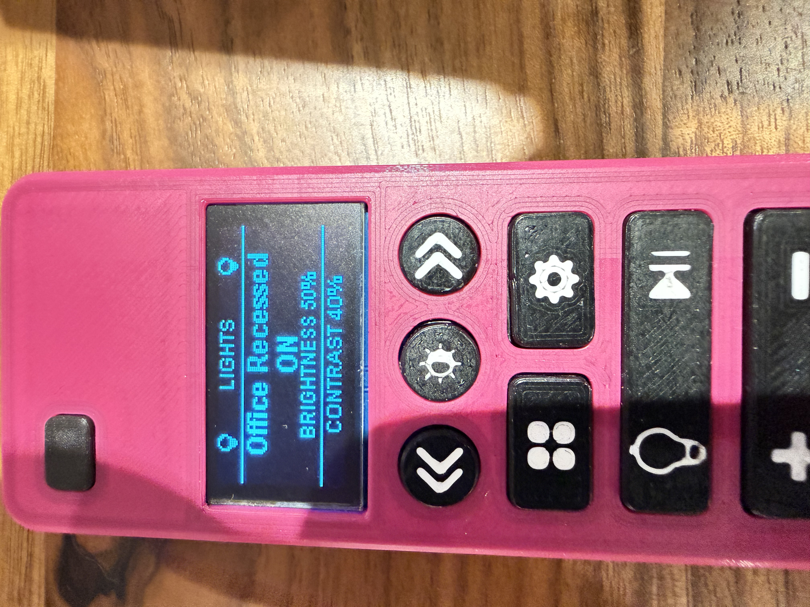

*The photo shows an earlier version of the screen; the screenshots below are the current UI.*

## Remote UI Screenshots

| 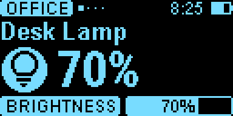<br><sub>Light</sub> | 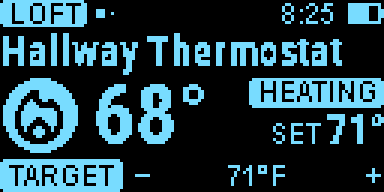<br><sub>Thermostat heating</sub> | 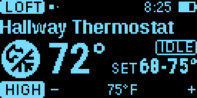<br><sub>Heat/cool thermostat</sub> | 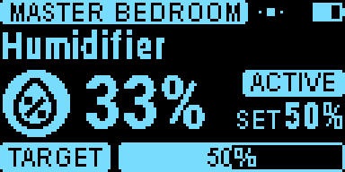<br><sub>Humidifier</sub> | 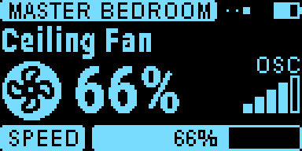<br><sub>Fan speed</sub> |
| :---: | :---: | :---: | :---: | :---: |
| 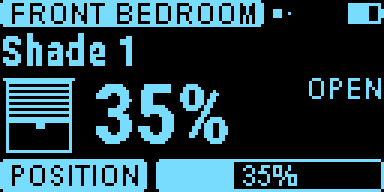<br><sub>Shade position</sub> | 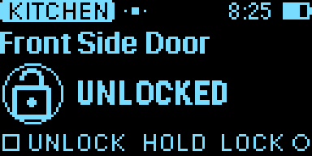<br><sub>Lock</sub> | 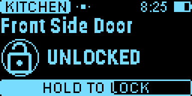<br><sub>Lock hold bar</sub> | 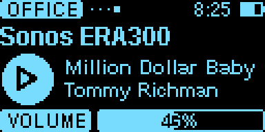<br><sub>Speaker</sub> | <br><sub>TV</sub> <tr></tr> |
| <br><sub>Switch</sub> | 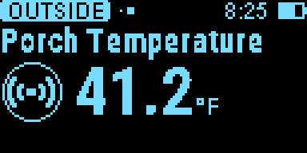<br><sub>Sensor</sub> | 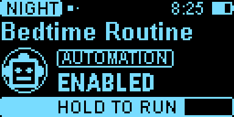<br><sub>Automation hold to run</sub> | 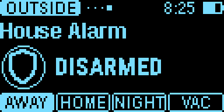<br><sub>Alarm arm modes</sub> | 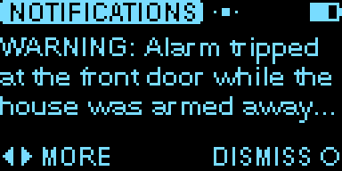<br><sub>Notification</sub> <tr></tr> |
| 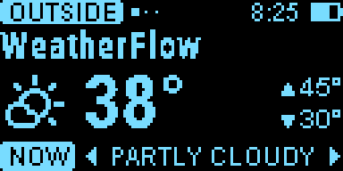<br><sub>Weather</sub> | 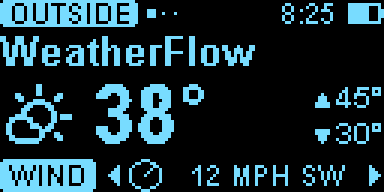<br><sub>Wind</sub> | 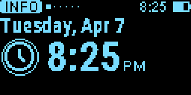<br><sub>Time and date</sub> | 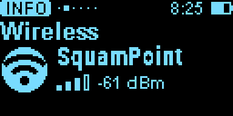<br><sub>Wi-Fi</sub> | <br><sub>Hold to reboot</sub> <tr></tr> |
| 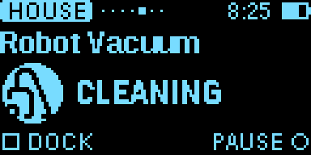<br><sub>Robot vacuum</sub> | 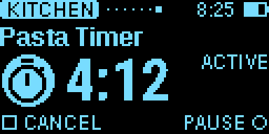<br><sub>Timer</sub> | 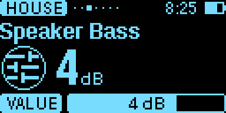<br><sub>Number</sub> | 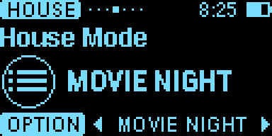<br><sub>Select</sub> | <br><sub>Waking up</sub> <tr></tr> |
| <br><sub>TV remote arrows</sub> | 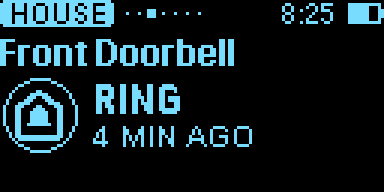<br><sub>Doorbell</sub> | 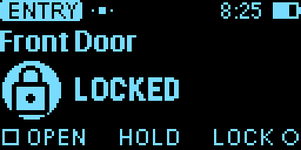<br><sub>Lock open</sub> | 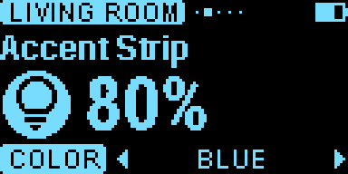<br><sub>Light colour</sub> | 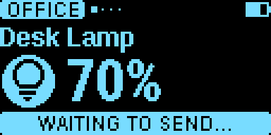<br><sub>Press waiting to send</sub> <tr></tr> |

## Features

- Graphical, button-driven UI designed for a 128x64 monochrome OLED: large values, icon badges that light up when a device is on, meters, toggles, and a footer that shows what the buttons do
- Hold-to-confirm progress bar for protected actions (locks, covers, automations, alarm)
- Hold `Previous`, `Next`, `Plus` or `Minus` to keep stepping; a held `Plus` or `Minus` sends Home Assistant only the value it stops on
- Deep sleep support for battery-powered remotes
- Wakes straight into the item it went to sleep on, shown as it was until the live values arrive; a press made meanwhile goes out once Home Assistant has connected. Dims the screen shortly before it sleeps
- Arrows, OK, Back and Home for Apple TV, Android TV, Roku, Samsung, Bravia and Philips TVs through Home Assistant's remote entities
- Multiple board package options for different PCB revisions
- Favorite-list navigation with mixed Home Assistant entity types in each list
- Favorite lists kept in Home Assistant, so changing them doesn't mean reflashing (optional; otherwise they're built into the firmware)
- Automatic hiding of empty favorite lists and optional Notifications mode
- Persistent restore of the current menu, selected item, contrast, and the setting you last picked after wake or reboot
- Notification, weather, and detailed info screens for time/date, wireless, network, device name, battery, and version
- Optional framebuffer download endpoint for capturing clean UI screenshots
- A preview tool that renders every screen on your computer, without flashing the remote

## Quick Start

If you just want to get the remote running:

1. Install ESPHome.
2. Copy [`esphome/examples/secrets-example.yaml`](esphome/examples/secrets-example.yaml) to [`esphome/secrets.yaml`](esphome/secrets.yaml) and fill in your Wi-Fi details and an API encryption key.
3. Copy [`esphome/examples/local_entities-example.h`](esphome/examples/local_entities-example.h) to [`esphome/local_entities.h`](esphome/local_entities.h) and define your favorite lists, or keep them in Home Assistant (see [Favorites from Home Assistant](#favorites-from-home-assistant)).
4. Copy [`esphome/examples/settings-example.yaml`](esphome/examples/settings-example.yaml) to `esphome/settings.yaml` and choose the correct PCB package.
5. Connect the remote over USB and run `esphome run esphome/remote_control.yaml` (the first flash must be over USB).
6. Add the remote to Home Assistant and allow it to perform Home Assistant actions (see [step 8](#8-add-the-remote-to-home-assistant)).

## Navigation Model

- One or more user-defined favorite lists containing mixed entity types
- Optional Notifications screen after the favorite lists
- Info screen always available at the end of the menu

The screen adapts to the type of the selected entity.

### Screen layout

Every screen uses the same four bands, so the remote reads the same way whatever is selected:

| Band | What it shows |
| --- | --- |
| Header (top row) | The list name in an inverted chip, followed by dots for your position in the list (or `3/12` for long lists). On the right: the clock, once Home Assistant has sent the time and when the list name leaves room for it, and the battery level on boards with battery monitoring. |
| Title | The entity name, in the name font (`NAME_FONT`; see [Choosing fonts](#choosing-fonts)). Long names step down a size, then to a smaller font, before they are shortened. |
| Hero | A round badge with the entity's icon on the left, and the main value in large digits beside it. A **lit badge** (icon cut out of a filled circle) means the device is on or active; an outlined badge means off. Thermostats, humidifiers and water heaters add a status chip at the top right (`HEATING`, `IDLE`, the heater's mode), filled while the device is actively working. Thermostats and humidifiers show their target as `SET 71°`; a water heater's target is its large value. Some types draw a picture instead: a toggle switch for switches, a window with its shade for covers, a weather icon for weather. |
| Footer (bottom row) | Whatever `Settings`, `Plus` and `Minus` (or the action buttons) control right now. |

Where there is something to control, the footer explains it (sensor and Info screens have none):

- **Meters** (brightness, fan speed, volume, position, humidity) fill to the value, with the value printed across them. `Plus` / `Minus` adjust it.
- **Steppers** (temperatures) show `- 71°F +`.
- **Option lists** (effects, presets, sources, modes) show `< VALUE >`; `Plus` / `Minus` step through them.
- **Toggles** (oscillate, shuffle, mute, away) show a small switch.
- **Button hints** show `□ OFF` on the left and `ON ○` on the right, matching the square and circle buttons. Protected actions add `HOLD`. While a cover or valve moves, both sides say `STOP`.
- **Hold bar**: while you hold a protected action, the footer fills from left to right and the action fires when the bar is full.
- **Toasts**: the result of an action (`LOCKING...`, `TRIGGERED`, `ALREADY ON`) replaces the footer for a few seconds.

The label at the left of the footer (for example `BRIGHTNESS` or `EFFECT`) names the setting `Settings` has selected; press `Settings` to move to the next one. Each item opens on the setting you last picked with `Settings` when it has that setting, otherwise on its first, so `Plus` and `Minus` work straight away. The choice is kept across sleep.

`SYNCING` in the large value, or `--` in the footer, means Home Assistant hasn't sent that value yet. `UNAVAILABLE` means Home Assistant reports the entity as unavailable; the action buttons then show `UNAVAILABLE` instead of sending a command.

## Hardware

This configuration is built around:

- ESP32 Lolin32 WROOM (WIFI + Bluetooth) development board
- 1.3-inch SH1106 128x64 OLED display over I2C
- Remote PCB designed by Pawel Lugowski
- Physical navigation and action buttons
- 3D Printed Case and Buttons

Board-specific wiring is selected through the PCB package include in your `esphome/settings.yaml`.

### ESP32 chip revision

[`esphome/remote_control.yaml`](esphome/remote_control.yaml) sets
`minimum_chip_revision: "3.0"`. ESP32 boards ship with different silicon revisions, and
the bootloader refuses any firmware built for a revision newer than the chip it is
running on. That check happens when an update is *finalized*, so a mismatch shows up as
an OTA that transfers to 100% and then fails, rather than as a build error.

If you flash a board older than rev 3.0, lower this value to match. The remote reports
its revision to a log client on the network (serial logging is off), so pick the network
option here:

```bash
esphome logs esphome/remote_control.yaml
# [I][app]: ESP32 Chip: ESP32 rev3.0, 2 core(s)
```

On a board that isn't running this firmware yet, the first USB flash prints
`Chip type: ... (revision vX.Y)`.

`esphome/remote_control.yaml` includes your `esphome/settings.yaml`, which holds the common substitutions, the PCB package selection, and the optional `web_server` block. It starts as a copy of [`esphome/examples/settings-example.yaml`](esphome/examples/settings-example.yaml) and is kept out of git, like `secrets.yaml`.

Please refer to the [Quick Start Guide](https://tech.lugowski.dev/smart-remote-kit/) for more details:

- `esphome/packages/pcb_rev1.yaml`
  Revision 1 board mapping (no OLED power control or battery monitoring)
- `esphome/packages/pcb_rev2.yaml`
  Revision 2 board mapping with battery monitoring (no OLED power control)
- `esphome/packages/pcb_rev31.yaml`
  Revision 3.1 mapping with OLED power control and battery monitoring

## Repo Layout

```text
esphome_remote/
├── .github/
│   ├── ISSUE_TEMPLATE/
│   │   ├── bug_report.yml
│   │   ├── config.yml
│   │   └── feature_request.yml
│   ├── scripts/
│   │   ├── bump_version.py
│   │   ├── generate_release_notes.py
│   │   ├── prepare_ci_config.py
│   │   ├── read_version.py
│   │   └── update_changelog.py
│   ├── workflows/
│   │   ├── ci.yml
│   │   └── release.yml
│   ├── dependabot.yml
│   └── release.yml
├── .vscode/
│   ├── c_cpp_properties.json
│   ├── extensions.json
│   ├── launch.json
│   └── settings.json          # gitignored; yours is local-only
├── .yamllint.yml
├── CHANGELOG.md
├── LICENSE
├── README.md
├── requirements.txt
├── assets/
│   └── fonts/
│       ├── LiberationSans-Bold.ttf
│       └── local/             # your own fonts; gitignored
├── esphome/
│   ├── .gitignore
│   ├── examples/
│   │   ├── local_entities-example.h
│   │   ├── secrets-example.yaml
│   │   └── settings-example.yaml
│   ├── packages/
│   │   ├── pcb_rev1.yaml
│   │   ├── pcb_rev2.yaml
│   │   ├── pcb_rev31.yaml
│   │   ├── remote_actions_automation.yaml
│   │   ├── remote_actions_climate_media.yaml
│   │   ├── remote_actions_devices.yaml
│   │   ├── remote_actions_feedback.yaml
│   │   ├── remote_actions_security.yaml
│   │   ├── remote_actions_values.yaml
│   │   ├── remote_button_action_scripts.yaml
│   │   ├── remote_button_press_scripts.yaml
│   │   ├── remote_display_runtime_globals.yaml
│   │   ├── remote_display_scripts.yaml
│   │   ├── remote_display_selection_globals.yaml
│   │   ├── remote_display_state_globals.yaml
│   │   ├── remote_fonts.yaml
│   │   ├── remote_inputs.yaml
│   │   ├── remote_runtime.yaml
│   │   ├── remote_ui_navigation_actions.yaml
│   │   ├── remote_ui_selection_scripts.yaml
│   │   └── remote_ui_setup_scripts.yaml
│   ├── local_entities.h       # your copy of the example; local-only
│   ├── oled_hold_release.h
│   ├── remote_control.yaml
│   ├── secrets.yaml           # your copy of the example; local-only
│   └── settings.yaml          # your copy of the example; local-only
├── home_assistant/
│   ├── remote_favorites.yaml
│   └── remote_notifications.yaml
├── include/
│   ├── entity_helpers_common.h
│   ├── entity_helpers.h
│   ├── entity_helpers_requests.h
│   ├── entity_trackers.h
│   ├── favorites_lists.h
│   ├── favorites_store.h
│   ├── framebuffer_web_debug.h
│   ├── local_entities.h
│   ├── oled_snapshot.h
│   ├── remote_ui_bindings.h
│   ├── remote_ui_feedback.h
│   ├── remote_ui_input_logic.h
│   ├── remote_ui_logic.h
│   ├── remote_ui_renderer.h
│   ├── remote_ui_runtime.h
│   ├── remote_ui_sync.h
│   ├── remote_ui_types.h
│   └── ui_state_helpers.h
├── images/
│   ├── remote_*.jpeg
│   └── remote_UI-*.png
├── platformio.ini
├── src/
│   ├── favorites_store.cpp
│   ├── framebuffer_web_debug.cpp
│   ├── oled_snapshot.cpp
│   ├── remote_ui_feedback.cpp
│   ├── remote_ui_input_logic.cpp
│   ├── remote_ui_logic.cpp
│   ├── remote_ui_renderer.cpp
│   ├── remote_ui_runtime.cpp
│   └── remote_ui_sync.cpp
└── tools/
    ├── favorites_to_home_assistant.py
    ├── pio_esphome_bridge.py
    └── ui_preview/
        ├── preview.py
        ├── scenarios.cpp
        ├── sim_display.h
        └── stress.cpp
```

## Important Files

- `esphome/remote_control.yaml`
  Main ESPHome entrypoint that pulls together shared packages, secrets, local entity definitions, fonts, and runtime logic. It also holds the firmware `VERSION`, which the release workflow bumps.
- `esphome/settings.yaml`
  Your settings: common substitutions, PCB selection, and optional web server settings. This file is ignored by Git; start it from `esphome/examples/settings-example.yaml`.
- `esphome/oled_hold_release.h`
  Releases the deep-sleep hold on the rev 3.1 OLED power pin at boot, so the display can power up.
- `include/entity_helpers.h`
  Compatibility shim that includes the tracker and request helper layers.
- `include/entity_trackers.h`
  Home Assistant tracker classes that subscribe to and cache entity state.
- `include/entity_helpers_common.h` and `include/entity_helpers_requests.h`
  Shared entity metadata/state helpers and the request/query layer built on top of the trackers.
- `esphome/local_entities.h`
  Your private Home Assistant entity definitions and favorite lists. This file is ignored by Git and lives next to `secrets.yaml` for a simpler compile workflow.
- `esphome/examples/local_entities-example.h`
  Example entity definitions and favorite lists you can copy and customize.
- `include/local_entities.h`
  Compatibility shim that forwards to `esphome/local_entities.h`.
- `include/favorites_lists.h`, `include/favorites_store.h` and `src/favorites_store.cpp`
  The favorite lists the remote uses: reading and checking the lists Home Assistant publishes, keeping them in flash, and choosing between them and `local_entities.h` at boot.
- `home_assistant/remote_favorites.yaml` and `tools/favorites_to_home_assistant.py`
  The Home Assistant template sensor that holds the favorite lists, and a script that writes it from your `local_entities.h`.
- `esphome/packages/`
  Modular ESPHome packages for actions, button/input handling, runtime behavior, display globals, fonts, and UI scripts.
- `src/remote_ui_renderer.cpp` and `include/remote_ui_renderer.h`
  Draws every screen of the UI from a plain render context. It has no dependency on Home Assistant or the trackers, which is what lets the preview tool build it on your computer.
- `include/remote_ui_types.h`
  UI enums (modes, settings, alarm arm modes) and small text helpers shared by the renderer and the rest of the firmware.
- `tools/ui_preview/`
  Renders every screen to PNG on your computer; see [Previewing the UI](#previewing-the-ui).
- `src/framebuffer_web_debug.cpp` and `include/framebuffer_web_debug.h`
  Optional debug-only PBM framebuffer export for screenshot capture.
- `src/oled_snapshot.cpp` and `include/oled_snapshot.h`
  Keep the last UI frame in RTC memory through deep sleep, so a wake can show it while the remote reconnects.
- `platformio.ini` and `tools/pio_esphome_bridge.py`
  Root PlatformIO wrapper that delegates the IDE build button and `pio run` to the ESPHome toolchain.
- `home_assistant/remote_notifications.yaml`
  Optional Home Assistant template sensor bridge for the Notifications mode.

## Architecture Notes

- `esphome/remote_control.yaml`
  Top-level composition file: imports the packages and C++ helpers, and holds the I2C bus, the display, Wi-Fi, the API, OTA and deep sleep.
- `include/entity_helpers_common.h`
  Favorite-list plumbing (including the build-time check that every favorite in `local_entities.h` has a supported `entity_id`), per-domain indexing, selection helpers, and configuration validation.
- `include/favorites_lists.h` and `src/favorites_store.cpp`
  The favorite lists in use, built once at boot from the lists saved from Home Assistant, or from `local_entities.h`, and never changed while the remote is awake: the trackers and Home Assistant's subscriptions keep pointers into them. Lists Home Assistant changes are checked as they arrive, saved to NVS as the remote goes to sleep, and used from the next wake. The first lists restart the remote, once per list. A saved list the remote crashes with three times running as it starts is set aside, in RTC memory, until Home Assistant sends a different one. `persist_ui_state` keeps a hash of the selected entity, so `follow_saved_selection` finds the item again when the lists change.
- `include/entity_trackers.h`
  Home Assistant tracker classes that subscribe to and cache entity state, one slot per favorite, sized at boot.
- `include/entity_helpers_requests.h`
  One tracker per domain, the subscription order (the current selection first, so it syncs first after a wake; the favorite lists from Home Assistant last), the memory check for new lists, and per-entity accessors.
- `src/remote_ui_sync.cpp`
  Copies the selected entity's tracked values into the UI globals.
- `include/remote_ui_types.h`
  UI enums and text helpers, with no dependency on ESPHome's API or the trackers.
- `src/remote_ui_renderer.cpp`
  `render_remote_ui()` and `render_system_screen()` draw every screen from a `RemoteRenderContext`, which `update_display` in `remote_display_scripts.yaml` fills each frame. The fonts are bound in `on_boot`.
- `src/remote_ui_runtime.cpp`
  Feedback and toast timeouts, and the 3-second hold after a command during which the remote shows what it sent rather than Home Assistant's not-yet-updated value.
- `src/remote_ui_input_logic.cpp`, `src/remote_ui_feedback.cpp` and `src/remote_ui_logic.cpp`
  Hold prompts, action verification, and the Info screen text.
- `include/remote_ui_bindings.h`
  Pointers to the YAML globals, set once in `on_boot`, plus builders for the reset and sync state.
- `include/ui_state_helpers.h`
  Packs the UI state saved across sleep: menu, selection, the chosen setting, arm mode and contrast.

The `esphome/packages/` folder is split by responsibility:

- `remote_actions_*.yaml`
  Entity actions and feedback flows grouped by domain. `remote_actions_values.yaml` sends what `Plus` and `Minus` change: a held value once the hold ends, an HVAC mode, select option or remote activity once the presses pause. Its `call_entity_action` sends one entity's action or a TV remote's command; like every script that waits for Home Assistant's answer it takes a single int (a slot from `queue_entity_request`), since ESPHome numbers those requests separately for each script parameter list.
- `remote_button_*.yaml`
  Button press handling and action wrapper scripts, including the press made while connecting after a wake, which waits for Home Assistant (`queue_press`).
- `remote_display_*.yaml`
  UI globals and the `update_display` script that fills the render context and calls the renderer.
- `remote_fonts.yaml`
  Fonts. The text fonts and their sizes come from the `*_FONT` settings in `settings.yaml`; the icons are Material Symbols, and every icon the renderer draws must be listed here.
- `remote_ui_*.yaml`
  UI setup, selection, and navigation scripts.
- `remote_inputs.yaml` and `remote_runtime.yaml`
  Physical input bindings and the runtime loop.

Every favorite's `entity_id` in `local_entities.h` is checked when the firmware is built: a missing one, or one in a domain the remote doesn't support (see [Supported Home Assistant Entity Domains](#supported-home-assistant-entity-domains)), stops the build with an error. Lists from Home Assistant get the same checks as the remote receives them, and one that fails is not used. At startup the remote also logs favorites that have no display name.

## 1. Install ESPHome

Follow the official directions on the [ESPHome website](https://esphome.io/guides/installing_esphome/).

If you're using MacOS, the easiest way to install is via [Homebrew](https://brew.sh/) by running this command in a MacOS terminal window:
```bash
/bin/bash -c "$(curl -fsSL https://raw.githubusercontent.com/Homebrew/install/HEAD/install.sh)"
```

Now install ESPHome:
```bash
brew install esphome
```

## 2. Clone The Repository

```bash
git clone https://github.com/kedube/esphome_remote
cd esphome_remote
```

## 3. Create Your Secrets File

Copy the example secrets file:

```bash
cp esphome/examples/secrets-example.yaml esphome/secrets.yaml
```

Then fill in your Wi-Fi details and an API encryption key:

```yaml
wifi_ssid: "YourWiFiName"
wifi_password: "YourWiFiPassword"
encryption_key: "YourESPHomeAPIKey"
alarm_code: ""
```

`encryption_key` must be 32 random bytes, base64-encoded; generate one with `openssl rand -base64 32`. It encrypts the connection to Home Assistant, and also encrypts and authenticates OTA updates, so there is no separate OTA password. Keep it private.

`alarm_code` is optional, but keep the line even when it's empty. Leave it empty unless your alarm integration requires a code (see the alarm notes in step 5).

## 4. Create Your Favorite Lists

Copy the example favorite-list file:

```bash
cp esphome/examples/local_entities-example.h esphome/local_entities.h
```

Edit `esphome/local_entities.h` so it matches your Home Assistant setup.

The file now only needs favorite lists. Each `FavoriteEntity` entry provides a display name and a Home Assistant `entity_id`, and the remote infers the entity type from the `entity_id` prefix such as `light.`, `switch.`, `climate.`, `weather.`, and so on.

You can define up to `MAX_PERSISTED_FAVORITE_LISTS` lists (16 by default, at most 30), each with up to 64 entries. A list with no entries is skipped in the menu; write it as `{"OUTDOOR", nullptr, 0}` in `FAVORITE_LISTS`, since an empty `FavoriteEntity` array doesn't compile.

Every entry needs an `entity_id` in a [supported domain](#supported-home-assistant-entity-domains); the build stops with an error otherwise.

_Example:_

```cpp
inline constexpr FavoriteEntity MAIN_FAVORITES[] = {
  {"Living Room Lamp", "light.living_room_lamp"},
  {"Bedroom TV", "media_player.bedroom_tv"},
  {"Main Thermostat", "climate.main_thermostat"},
  {"Front Door", "lock.front_door"},
};

inline constexpr FavoriteList FAVORITE_LISTS[] = {
  make_favorite_list("MAIN", MAIN_FAVORITES),
};
```

Minimal multi-list example:

```cpp
inline constexpr FavoriteEntity UPSTAIRS_FAVORITES[] = {
  {"Hallway Thermostat", "climate.hallway_thermostat"},
  {"Bedroom Fan", "fan.bedroom_fan"},
};

inline constexpr FavoriteList FAVORITE_LISTS[] = {
  make_favorite_list("UPSTAIRS", UPSTAIRS_FAVORITES),
  {"OUTDOOR", nullptr, 0},  // nothing here yet: hidden from the menu
};
```

### Favorites from Home Assistant

Home Assistant can hold the favorite lists instead, so you can change them without rebuilding the firmware. Add a template sensor whose `lists` attribute holds them as text. Copy [`home_assistant/remote_favorites.yaml`](home_assistant/remote_favorites.yaml) into your Home Assistant configuration, or include it as a package:

```yaml
template:
  - sensor:
      - name: Remote Favorites
        unique_id: remote_favorites
        state: "ok"
        attributes:
          lists: |
            #LIVING ROOM
            Lamp|light.living_room_lamp
            Speaker|media_player.living_room_speaker|Spotify|Radio|Line In
            Apple TV|remote.living_room_apple_tv|apple_tv
            #KITCHEN
            Ceiling Light|light.kitchen_ceiling
            Pasta Timer|timer.kitchen
```

- A line starting with `#` starts a list and names it. Each line after it is a favorite, `Name|entity_id`, with the optional third field ([TV remote](#tv-remotes-third-field) commands, [media player sources](#media-player-sources-optional-third-field)) after another `|`. The remote shows them in this order. Blank lines and spaces around the fields don't matter.
- To start from the lists you have, run `python3 tools/favorites_to_home_assistant.py`. It prints this sensor with everything in `esphome/local_entities.h`.
- After editing the lists, reload them in Home Assistant: **Developer tools → YAML → Template entities**.

The remote reads `sensor.remote_favorites`. To give a remote other lists, point it at another sensor in `esphome/local_entities.h`:

```cpp
#define FAVORITES_ENTITY "sensor.bedroom_remote_favorites"
```

How the remote uses the lists:

- It saves them in flash and uses them from then on, Home Assistant down or not. `local_entities.h` only counts until the first lists arrive, or if you set `FAVORITES_ENTITY` to `""` to turn this off.
- The first lists it gets, it restarts to use straight away (`NEW FAVORITES`).
- After that, the remote picks up a change the next time it's awake, saves it as it goes to sleep, and uses it from the wake after. To use it straight away, hold the power button to restart the remote. When the lists change, the remote stays on the item it was on, if that's still in them.
- It checks the lists as they arrive, the way the build checks `local_entities.h`. If any line is wrong, it ignores the whole update and keeps the lists it has.
- The lists must fit the remote: at most `MAX_PERSISTED_FAVORITE_LISTS` lists (16 by default), 64 favorites in a list and 8 KB of text, and no more than it has memory for. How many favorites that is depends on their kind: a thermostat takes far more memory than a switch. The remote turns down lists it can't hold and says so. (Text over 32 KB is more than ESPHome's connection takes in one message: the remote drops its connection to Home Assistant instead, so the status can't say why.)
- If the remote crashes three times running as it starts with saved lists, it goes back to `local_entities.h` until Home Assistant sends different lists, or the remote loses power.

The remote's **Favorites status** sensor in Home Assistant says which lists it uses, and when it didn't take an update, why, with the line at fault: for example `Not used: line 7: Light.Office isn't an entity ID (lower-case letters, digits and _, with one dot). Still using the previous list.`

### Light warmth and colour (optional)

Lights with a colour temperature get a `WARMTH` setting, and lights that take a colour a `COLOR` setting. Following them costs Home Assistant subscriptions: three per light for warmth and one per light for colour. With many lights a wake takes a little longer before every light has synced (the item the remote wakes into, and its list, still sync first). To go without either, add these lines to `esphome/local_entities.h`:

```cpp
#define LIGHT_WARMTH 0
#define LIGHT_COLOR 0
```

### TV remotes (third field)

A TV or streaming box's `remote` entity takes a third field naming the commands it understands, since each Home Assistant integration names its keys differently:

```cpp
inline constexpr FavoriteEntity DEN_FAVORITES[] = {
  {"TV", "media_player.den_tv"},
  {"TV Remote", "remote.den_tv", "samsung"},
};
```

| Third field | Integration | Up, down, left, right, OK, back, home |
| --- | --- | --- |
| `apple_tv` | Apple TV | `up` `down` `left` `right` `select` `menu` `home` |
| `android_tv` | Android TV Remote | `DPAD_UP` `DPAD_DOWN` `DPAD_LEFT` `DPAD_RIGHT` `DPAD_CENTER` `BACK` `HOME` |
| `roku` | Roku | `up` `down` `left` `right` `select` `back` `home` |
| `samsung` | Samsung Smart TV | `KEY_UP` `KEY_DOWN` `KEY_LEFT` `KEY_RIGHT` `KEY_ENTER` `KEY_RETURN` `KEY_HOME` |
| `bravia` | Sony Bravia TV | `Up` `Down` `Left` `Right` `Confirm` `Return` `Home` |
| `philips` | Philips TV | `CursorUp` `CursorDown` `CursorLeft` `CursorRight` `Confirm` `Back` `Home` |

For anything else, list the seven commands yourself, in that order and separated by `|`. A Harmony hub also needs the device the commands go to, as an eighth item (the commands are the ones the Harmony app lists for that device):

```cpp
  {"Harmony", "remote.living_room", "DirectionUp|DirectionDown|DirectionLeft|DirectionRight|Select|Back|Home|Samsung TV"},
```

Without a third field, a remote only offers its `ACTIVITY` list, if it has one. A third field that is neither a name above nor seven or eight commands stops the build with an error. Which keys a TV accepts can vary by model; one it rejects shows `COMMAND FAILED`. Turn the TV on and off from its media player favorite: Home Assistant's `remote.turn_on` and `remote.turn_off` mean different things to different integrations (for an Apple TV they only connect or disconnect Home Assistant).

### Media player sources (optional third field)

A favorite entry accepts an optional third field listing selectable sources, separated
by `|`:

```cpp
inline constexpr FavoriteEntity LIVING_ROOM_FAVORITES[] = {
  {"Speaker", "media_player.living_room_speaker", "Spotify|Radio|Line In"},
};
```

The remote resolves a media player's source list like this:

- **TVs and receivers** (Home Assistant `device_class` of `tv` or `receiver`) use the
  live `source_list` reported by Home Assistant, falling back to this field when Home
  Assistant reports none.
- **Every other media player** uses the sources you list here. Home Assistant does not
  reliably expose a usable `source_list` for those, so without this field the remote has
  nothing to cycle and the `SOURCE` setting does not appear.

Source names must not contain a `|`, since that is the separator. A name written here
that contains one is silently split into two entries, so pick names without it. (Source
names arriving from Home Assistant for a TV or receiver are checked and skipped with a
warning instead.)

Notifications are configured in the same file with optional feed defines:

```cpp
#define NOTIFICATION_FEED_ENTITY "sensor.remote_notifications"
#define NOTIFICATION_FEED_ATTRIBUTE "messages"
#define NOTIFICATION_FEED_IDS_ATTRIBUTE "ids"
#define NOTIFICATION_FEED_SEPARATOR "||"
```

Notes:

- Set `NOTIFICATION_FEED_ENTITY` to an empty string to hide Notifications completely.
- `NOTIFICATION_FEED_ENTITY` is the Home Assistant entity the remote reads from.
- `NOTIFICATION_FEED_ATTRIBUTE` is the attribute on that entity containing the notification payload.
- `NOTIFICATION_FEED_IDS_ATTRIBUTE` is the attribute on that entity containing notification IDs for dismiss actions.
- `NOTIFICATION_FEED_SEPARATOR` is used when multiple notifications are packed into one string.

Since Home Assistant no longer exposes a ready-made `sensor.persistent_notifications`, the included template sensor must be added to Home Assistant to recreate the feed the remote expects.

Copy [`home_assistant/remote_notifications.yaml`](home_assistant/remote_notifications.yaml) into your Home Assistant `template:` configuration, or include it as a package. It publishes:

- `sensor.remote_notifications`
- state = current notification count
- attribute `messages` = the newest 16 active persistent notifications, each cut to 120 characters, packed into one `||`-separated string (the remote ignores a feed over 8 KB)
- attribute `ids` = matching persistent notification IDs packed in the same order

This bridge is event-driven. It listens for Home Assistant `persistent_notification` updates, stores the active notification list in the template sensor’s own attributes, and exposes a `messages` attribute that the remote can read. Each item is emitted as `Title: Message`, with newlines flattened to spaces so the remote can render them cleanly.

In Notifications mode, pressing the circle or play/pause action button dismisses the currently selected persistent notification. The display shows `DISMISSED` for 3 seconds, then refreshes and advances to the next remaining notification.

## 5. Configure `settings.yaml`

Copy the example settings file, then edit the copy:

```bash
cp esphome/examples/settings-example.yaml esphome/settings.yaml
```

This is the main file for device-level customization. Like `secrets.yaml`, it is kept out of git, so pulling updates never overwrites your settings. After an update, compare it with the example for new settings: a setting your copy lacks stops the build with a warning that it `is undefined`.

Use this file for three things:

1. Select the PCB package that matches your hardware.
2. Set the shared substitutions that control naming, timing, and battery behavior.
3. Enable optional features such as framebuffer web debugging.

Start by choosing the board package that matches your remote hardware PCB:

```yaml
packages:
  select_pcb: !include
    #file: packages/pcb_rev1.yaml
    #file: packages/pcb_rev2.yaml
    file: packages/pcb_rev31.yaml
```

  The same file also contains the most common substitutions you may want to change:

| Setting | Purpose |
| --- | --- |
| `BOARD` | ESPHome board definition, currently `esp32dev`. |
| `DEVICE_NAME` | Network name used by ESPHome and OTA. |
| `FRIENDLY_NAME` | Human-readable device name shown in Home Assistant. |
| `NOTIFICATION_FEED_MAX_ITEMS` | Maximum number of notification messages cached and exposed in Notifications mode. |
| `MAX_PERSISTED_FAVORITE_LISTS` | Compile-time capacity limit for configured favorite lists. This must be at least as large as your configured favorite list count. |
| `TEMPERATURE_UNIT` | Set to `"F"` or `"C"` to match your Home Assistant climate and water heater values. Weather screens use the units the weather entity reports. |
| `LABEL_FONT`, `LABEL_FONT_SIZE` | Header, chips and footer labels. Liberation Sans Bold, `"9"`. Each font setting takes a font file or a Google Font; see [Choosing fonts](#choosing-fonts). |
| `TEXT_FONT`, `TEXT_FONT_SIZE` | Media titles, notifications, units and the weather high/low. Liberation Sans Bold, `"10"`. |
| `NAME_FONT`, `NAME_FONT_SIZE`, `NAME_FONT_SMALL_SIZE` | Entity names, and the size for names too wide for `NAME_FONT_SIZE` (longer names use `TEXT_FONT`, then are shortened). Liberation Sans Bold, `"12"` and `"11"`. |
| `STATE_FONT`, `STATE_FONT_SIZE` | State words such as `UNLOCKED`, setpoints, Info lines and headlines. Roboto Condensed Bold, `"14"`. |
| `VALUE_FONT`, `VALUE_FONT_SIZE` | Large values such as `70%` and `68°`. Roboto Condensed Bold, `"28"`. |
| `SLEEP_DURATION` | Idle time before the remote sleeps, in seconds, written as a plain number (`"90"`, not `"90s"`). |
| `DEEP_SLEEP_DURATION` | Maximum awake time before the remote enters deep sleep. **Do not set this to `0`.** ESPHome reads `0` as "sleep immediately after boot", which makes the remote unusable and OTA updates nearly impossible to land. To disable forced deep sleep, delete the `run_duration:` line from the `deep_sleep:` block in `esphome/remote_control.yaml` (keep the block: powering off uses it), or use a long duration such as `"1440min"`. |
| `LONG_PRESS_DURATION_MS` | Hold time for protected actions. |
| `EXTENDED_HOLD_DURATION_MS` | Shared hold time for long protected actions that use the extended timer, including the Settings button alarm trigger and wake-button reboot. |
| `WAKE_BUTTON_DEBOUNCE_MS` | Debounce time for the wake/power button press and release handling. |
| `BUTTON_DEBOUNCE_MS` | Debounce time for every other button. A press or release only counts once the button has held that state this long. Raise it if a single tap still registers twice; lower it only if fast repeated taps are being dropped. |
| `NAVIGATION_SYNC_DELAY_MS` | Short quiet period after navigation before subscription-backed state sync resumes. |
| `REBOOT_MESSAGE_DURATION_MS` | How long the `REBOOTING...` message stays on screen before the remote restarts. |
| `ALARM_STATUS_UPDATE_DELAY_MS` | How long an alarm panel has to reach the requested state, or start its exit or entry delay, before the remote shows `FAILED`. |
| `SAFE_MODE_BOOT_IS_GOOD_AFTER` | How long a new boot must survive before ESPHome considers it successful for safe mode and OTA rollback. |
| `LOW_BATTERY_VOLTAGE` | Battery warning threshold for battery-monitoring boards. |
| `BATTERY_DIVIDER_MULTIPLIER` | Voltage divider scaling factor for battery-monitoring boards. |
| `BATTERY_VOLTAGE_MIN` | Battery voltage treated as 0% for the percentage estimate. |
| `BATTERY_VOLTAGE_MAX` | Battery voltage treated as 100% for the percentage estimate. |
| `BATTERY_VOLTAGE_CURVE_GAMMA` | Curve shaping factor for the battery percentage estimate. |
| `FRAMEBUFFER_WEB_DEBUG` | Set to `"1"` only when using the optional framebuffer download endpoint. |
| `OLED_POWER_ON_SETTLE_MS` | Rev 3.1 only: how long to wait after powering the OLED before the display starts. Raise it if the screen sometimes stays dark after waking. |

Notes:

- `NOTIFICATION_FEED_MAX_ITEMS` and `MAX_PERSISTED_FAVORITE_LISTS` are compile-time capacity limits. Changing them requires recompiling the firmware and may increase memory usage.
- The timing substitutions such as `SLEEP_DURATION`, `LONG_PRESS_DURATION_MS`, `EXTENDED_HOLD_DURATION_MS`, `WAKE_BUTTON_DEBOUNCE_MS`, `BUTTON_DEBOUNCE_MS`, `NAVIGATION_SYNC_DELAY_MS`, `REBOOT_MESSAGE_DURATION_MS`, `ALARM_STATUS_UPDATE_DELAY_MS`, and `SAFE_MODE_BOOT_IS_GOOD_AFTER` control runtime behavior and are the safest settings to tune first.
- Safe starting points:
  `NOTIFICATION_FEED_MAX_ITEMS: "16"`, `MAX_PERSISTED_FAVORITE_LISTS: "16"`, `WAKE_BUTTON_DEBOUNCE_MS: "30"`, `BUTTON_DEBOUNCE_MS: "30"`, `NAVIGATION_SYNC_DELAY_MS: "250"`, `REBOOT_MESSAGE_DURATION_MS: "2000"`, `SAFE_MODE_BOOT_IS_GOOD_AFTER: "10s"`.

### Faster wakes with a fixed IP address

Every wake starts by asking your router for an IP address. With a fixed one, the remote skips that and reaches Home Assistant sooner. Add a `wifi:` block to `esphome/settings.yaml` (the example file has it, commented out), with an address outside your router's DHCP range or one you reserve for the remote there:

```yaml
wifi:
  manual_ip:
    static_ip: 192.168.1.50
    gateway: 192.168.1.1
    subnet: 255.255.255.0
    dns1: 192.168.1.1
```

Compare the **Wake to Home Assistant** sensor's history before and after (see [step 8](#8-add-the-remote-to-home-assistant)), or watch `esphome logs`, which says how long Wi-Fi and Home Assistant each took after a wake.

### Choosing fonts

Each `*_FONT` setting takes a `.ttf`, `.otf` or `.bdf` file (path relative to `esphome/`) or `"gfonts://Family@700"` for a Google Font, and each size setting a height in pixels (for a `.bdf` bitmap font, its point size). Put fonts you add in `assets/fonts/local/`, which git ignores, for example `NAME_FONT: "../assets/fonts/local/Arial Narrow Bold.ttf"`. Fonts that come with your computer, and trial or commercial fonts, usually can't be redistributed, so keep them out of the rest of the repository.

The display lights each pixel fully or not at all, so text can't be smoothed. A font looks clean on it when its hinting places every stroke on whole pixels, which suits fonts made for screens. These render well for entity names:

| Font | `NAME_FONT_SIZE` / `NAME_FONT_SMALL_SIZE` | Where to get it |
| --- | --- | --- |
| Liberation Sans Bold (default) | `12` / `11` | `assets/fonts/LiberationSans-Bold.ttf`; free, with Arial's letter widths |
| Arial Bold | `13` / `12` | Included with macOS and Windows |
| Arial Narrow Bold | `15` / `14` | Included with macOS and Windows; condensed, so names can be larger |
| Trebuchet MS Bold | `13` / `12` | Included with macOS and Windows |
| DejaVu Sans Condensed Bold | `13` / `12` | Free, from [dejavu-fonts.github.io](https://dejavu-fonts.github.io/); wider, so long names step down sooner |
| Helvetica Bold bitmaps (`helvB14.bdf` / `helvB12.bdf`) | `14` / `12` | Free, in X.Org's [`font-adobe-75dpi`](https://www.x.org/releases/individual/font/); wide |

Name sizes from 12 to 15 fit the name line. The other fonts sit in tighter spaces: labels fill 9- to 11-pixel bars, so keep `LABEL_FONT` capitals about 7 pixels tall (Liberation Sans Bold at 9), and a wider `VALUE_FONT` leaves less room for the setpoint beside the value.

Every text font must include the characters the remote uses (Latin-1 plus ‘ ’ “ ” – — • € …); if any are missing, the build stops and lists them. Run `python3 tools/ui_preview/preview.py` to see every screen in your fonts before flashing.

`esphome/remote_control.yaml` includes this settings file. The pins shared by every board are in `esphome/remote_control.yaml`; the selected PCB package adds the dimmer, circle, battery and OLED-power pins.

If your alarm integration requires a code, add it to `esphome/secrets.yaml`:

```yaml
alarm_code: "1234"
```

The `ALARM_CODE` substitution is already wired to `!secret alarm_code` in `esphome/remote_control.yaml`, so no other file needs to change. Leave `alarm_code` empty in `esphome/secrets.yaml` if your integration does not use a code — the remote will arm and disarm without one.

## 6. Validate The Configuration

```bash
esphome config esphome/remote_control.yaml
```

## 7. Build And Flash

```bash
esphome run esphome/remote_control.yaml
```

You must connect the remote via USB to your computer in order to perform the first flash. It will prompt you after a successful build for where to upload the code. After the first flash, future updates can be done over OTA.

```text
INFO Build Info: config_hash=0x694d2e36 build_time_str=2026-04-01 14:02:17 -0400
INFO Successfully compiled program.
Found multiple options for uploading, please choose one:
  [1] /dev/cu.usbserial-8320 (USB Serial)
  [2] Over The Air (remote31.local)
(number):
```

The OTA option is named after `DEVICE_NAME` in `esphome/settings.yaml`.

The first flash must be over USB even if the remote already runs other ESPHome firmware, such as the original configuration. This firmware maps extra memory (`sram1_as_iram`) that needs a bootloader from ESP-IDF 5.1 or later, and only a USB flash updates the bootloader. Installed over OTA on top of older firmware, it won't boot until you flash it over USB.

### Building From VS Code / PlatformIO IDE

ESPHome builds the firmware itself, with ESP-IDF, under `esphome/.esphome/build/<device>/`, so the root `platformio.ini` doesn't compile it directly. Instead, its default build target delegates to the ESPHome toolchain through `tools/pio_esphome_bridge.py`. This means the PlatformIO IDE build button just works, as do the equivalent terminal commands:

```bash
pio run                    # runs: esphome compile esphome/remote_control.yaml
pio run -t esphome-upload  # runs: esphome run esphome/remote_control.yaml (build + flash)
```

The `.vscode/` folder has IntelliSense settings (`c_cpp_properties.json`), extension recommendations, and launch settings for working on the C++ sources in `include/` and `src/`. Its include paths point at the author's own checkout, so adjust them for yours.

## 8. Add The Remote To Home Assistant

1. In Home Assistant, go to **Settings → Devices & services**. The remote is usually discovered as an ESPHome device; otherwise, add the **ESPHome** integration and enter `<DEVICE_NAME>.local` (or its IP address).
2. Enter the `encryption_key` from `esphome/secrets.yaml` when asked.
3. Open the ESPHome integration's entry for the remote, choose **Configure**, and turn on **Allow the device to perform Home Assistant actions**. Every button on the remote works by asking Home Assistant to perform an action, so without this nothing responds.
4. Optionally, add the notifications package (see [step 4](#4-create-your-favorite-lists)).

The remote has to be awake while you add it: press a button first.

Besides its battery sensors, the remote adds a diagnostic **Wake to Home Assistant** sensor: how many milliseconds each wake took to reach Home Assistant. Its history shows whether a change such as a [fixed IP address](#faster-wakes-with-a-fixed-ip-address) helps.

## Previewing the UI

`tools/ui_preview/preview.py` draws every screen on your computer, pixel for pixel as the remote shows it, so you can check a UI change without flashing. It compiles the real renderer (`src/remote_ui_renderer.cpp`) together with ESPHome's own display and font code and the fonts chosen in your `esphome/settings.yaml`, and renders the sample states in `tools/ui_preview/scenarios.cpp`. `--readme` uses the fonts in `esphome/examples/settings-example.yaml`, so the screenshots don't depend on your settings.

```bash
python3 tools/ui_preview/preview.py              # writes tools/ui_preview/.cache/ui_preview.png
python3 tools/ui_preview/preview.py --frames out # also one PNG per screen
python3 tools/ui_preview/preview.py --readme     # refreshes the screenshots in images/
python3 tools/ui_preview/preview.py --stress     # also stress-tests the renderer
```

`--stress` builds `tools/ui_preview/stress.cpp` with AddressSanitizer and UndefinedBehaviorSanitizer and draws every mode and setting with hostile input: empty, huge and malformed text, text cut in the middle of a character, and missing (NaN) or out-of-range readings. It stops with a report on the first out-of-bounds read or undefined behaviour, which on the remote would draw garbage or crash it. CI runs it on every change.

It needs ESPHome, a C++ compiler (`clang++` or `g++`), and network access the first time so ESPHome can download the Google fonts. It runs on macOS and Linux.

## Optional Framebuffer Download Debugging

If you want clean screenshots of the OLED UI, the project can expose the current framebuffer as a downloadable PBM image.

Enable the framebuffer debug flag in your `esphome/settings.yaml`:

```yaml
substitutions:
  FRAMEBUFFER_WEB_DEBUG: "1"
```

Then, uncomment the web server section in the same file; the debug endpoint doesn't
compile without it. The web server has no authentication unless you add it, so include
credentials, and set non-empty `web_server_username` and `web_server_password` in
`esphome/secrets.yaml`. Without them, anyone on your network can read the live screen
(which can show alarm state, lock state, and notification text) and toggle any entity
the device exposes:

```yaml
web_server:
  port: 80
  auth:
    username: !secret web_server_username
    password: !secret web_server_password
```

You can also use a CLI substitution override:

```bash
esphome -s FRAMEBUFFER_WEB_DEBUG 1 config esphome/remote_control.yaml
esphome -s FRAMEBUFFER_WEB_DEBUG 1 run esphome/remote_control.yaml
```

After flashing, browse to:

- `http://<DEVICE_NAME>.local/debug/framebuffer.pbm` (for example `http://remote31.local/debug/framebuffer.pbm`)

Notes:

- The framebuffer download endpoint is off by default.
- If `FRAMEBUFFER_WEB_DEBUG` is enabled but `web_server:` remains commented out, the firmware doesn't compile.
- The PBM image is generated from the live OLED framebuffer.
- This is mainly intended for debugging and README screenshots. Re-comment the
  `web_server:` block and set `FRAMEBUFFER_WEB_DEBUG` back to `"0"` when you are
  finished, so the remote is not left serving its screen on your network.

## Button Guide

The remote is designed around ten physical inputs:

| Button | Default behavior |
| --- | --- |
| Wake / Power | Wakes the remote, straight into the item it went to sleep on. A short press and release puts it to sleep. Hold for `EXTENDED_HOLD_DURATION_MS` to reboot: a bar fills while you hold, and releasing once it is full reboots. |
| Mode | Cycles to the next favorite list, then Notifications and Info. |
| Previous | Selects the previous item in the current list. Hold it to keep going; it stops at the first item. On a TV remote's `NAVIGATE`, the remote's left arrow. |
| Next | Selects the next item in the current list. Hold it to keep going; it stops at the last item. On a TV remote's `NAVIGATE`, the remote's right arrow. |
| Dimmer | Steps the OLED contrast through ten levels and wraps around; a `CONTRAST` meter shows in the footer for a few seconds. |
| Settings | Cycles through the settings the current item offers. In alarm mode, hold for `EXTENDED_HOLD_DURATION_MS` to trigger the alarm; a shorter press does nothing there. |
| Minus | Decreases the selected setting. Hold it to keep decreasing a value with a range (brightness, warmth, temperatures, humidity, speed, volume, positions, numbers). In Weather it steps back through the weather details, and in Notifications it moves to the previous notification. On a TV remote's `NAVIGATE`, the remote's down arrow. |
| Plus | Increases the selected setting, and keeps increasing while held, as `Minus` does. In Weather it steps forward through the weather details, and in Notifications it moves to the next notification. On a TV remote's `NAVIGATE`, the remote's up arrow. |
| Circle | Positive or activate action in most modes: turn on, open, lock, play/pause, run, press, start, arm, or dismiss. Stops a moving cover or valve. On a TV remote, `OK` (in `NAVIGATE`) or `HOME`. |
| Square | Negative or deactivate action in most modes: turn off, close, unlock, open a lock, stop, cancel, dock, or disarm. Stops a moving cover or valve. On a TV remote, `BACK`. |

Common usage pattern:

- Use `Mode` to move between favorite lists, Notifications, and Info.
- Use `Previous` and `Next` to choose an item.
- Use `Settings` to pick which setting you want to adjust; the footer names it.
- Use `Plus` and `Minus` to change the selected value or browse weather details.
- Use `Circle` and `Square` for the main action on the current item.
- Hold `Previous` or `Next` to get through a long list, and `Plus` or `Minus` to make a big change. A held `Plus` or `Minus` changes the value on screen and sends it to Home Assistant once, when you let go, so a light doesn't step through every level and a thermostat isn't sent every degree. Lists (effects, presets, sources) and toggles step once per press.

`Circle`, `Square`, `Plus` and `Minus` (and a TV remote's arrows) only send once Home Assistant has connected after a wake: it would drop commands sent earlier. A press made before then, on the item shown from before sleep, waits instead. The footer says `WAITING TO SEND…`, and the press goes out half a second after Home Assistant has sent that item's state, so a toggle acts on what the item is doing now. Only the latest press waits, for up to 10 seconds. It is dropped if you choose another item or setting first, or press a button again once connected. If the item no longer offers the setting the screen showed (a light turned on while the remote slept), the footer says `NOT SENT` instead. Presses that must be held (locks, covers, automations, alarms) don't wait.

Long-press protection:

- Locks, covers and valves require holding either action button for `LONG_PRESS_DURATION_MS`. A cover or valve that is moving stops at a tap of either button, if it supports stopping.
- Automations, scripts, scenes and buttons require holding `Circle` for `LONG_PRESS_DURATION_MS`. `Square` has no action in automation mode.
- Alarm arming and disarming also use long-press protection.
- Alarm trigger on the Settings button (on panels that support it) and wake-button reboot both use `EXTENDED_HOLD_DURATION_MS`.

## Mode Map

| Mode | Primary actions |
| --- | --- |
| Favorites: Lights | `Circle` on (at its last brightness), `Square` off. `Settings` picks `BRIGHTNESS`, `EFFECT`, `WARMTH` or `COLOR`; `Plus` / `Minus` adjust it, brightness in 10% steps (`Minus` at 10% turns the light off). `WARMTH`, on lights with a colour temperature, goes warmer with `Plus` and cooler with `Minus`, a tenth of the light's range at a time. `COLOR`, on lights that take a colour, steps through white, red, orange, yellow, green, cyan, blue, purple, magenta and pink, starting from the one nearest the light's colour; each press changes the light. While the light is off, `Plus` turns it on. A light that can't dim shows `ON` / `OFF`. |
| Favorites: Switches | `Circle` on, `Square` off. `input_boolean` helpers work the same way. |
| Favorites: Climate | `Circle` on (in the thermostat's last active mode), `Square` off. `Settings` cycles `TARGET` (or `LOW` and `HIGH` in heat/cool), `FAN`, `SWING`, `HUMIDITY`, `PRESET`, `STATUS` and `MODE`; `STATUS` is read-only, and `SWING` steps through the louvre settings of a thermostat that swings them. `MODE` steps through the thermostat's HVAC modes: the screen changes at once, and the mode goes to the thermostat 1.5 seconds after the last press, so stepping from heat past cool to auto never switches the system to cool. |
| Favorites: Humidifiers | `Circle` on, `Square` off. `Settings` cycles `TARGET` humidity, `MODE`, `STATUS` and `POWER`; `STATUS` and `POWER` are read-only. |
| Favorites: Fans | `Circle` on (at its last speed), `Square` off. `Settings` cycles `SPEED`, `PRESET`, `OSCILLATE` and `DIRECTION`; `Plus` / `Minus` step the speed by the fan's own speed increments, and `Minus` below the lowest speed turns it off. While the fan is off, `Plus` turns it on at its last speed. |
| Favorites: Covers and valves | `Circle` open, `Square` close (both held). While one that can stop is moving, the footer shows `STOP` and either button stops it straight away. `Settings` selects `POSITION` or `TILT` when the cover has them (valves have no tilt); `Plus` / `Minus` move it 10% at a time, and `Minus` at 10% or less closes it. |
| Favorites: Locks | `Circle` lock, `Square` unlock (both held). On a lock that can unlatch the door, `Settings` switches `Square` to `OPEN` (held), which calls `lock.open`. A lock that is `OPEN` (unlatched) counts as unlocked. |
| Favorites: TV remotes | Home Assistant `remote` entities (Apple TV, Android TV, Roku, Samsung, Bravia, Philips, Harmony). `Square` sends `BACK` and `Circle` `HOME`. `Settings` picks `NAVIGATE`, where `Previous` / `Next` / `Minus` / `Plus` are the remote's left / right / down / up arrows and `Circle` is `OK`; the arrow just sent lights up on screen, and holding one keeps sending it. `ACTIVITY`, on a Harmony hub or the apps set up in Android TV Remote, steps through activities and starts the one shown 1.5 seconds after the last press. Moving to another item never lands in `NAVIGATE`, so `Previous` and `Next` still move through the list; waking does return to it. Power stays with the TV's own media player. See [TV remotes](#tv-remotes-third-field). |
| Favorites: Media | `Circle` play/pause, or turns on a player that is off or in standby. `Square` stops, or turns off a TV or receiver. `Settings` cycles `TRACK` (`CHANNEL` on TVs), `VOLUME`, `MUTE`, `SOURCE`, `SHUFFLE`, `REPEAT`, `SOUND` and `STATE`; on `TRACK` / `CHANNEL`, `Plus` / `Minus` skip, and on `MUTE`, `Plus` mutes and `Minus` unmutes. A muted player shows a crossed-out speaker (`MUTED` on a TV). |
| Favorites: Water Heaters | `Circle` on, `Square` off (through the heater's operation modes when it has no on/off of its own). `Settings` cycles `TARGET`, `MODE` and `AWAY`; `Plus` / `Minus` adjust the target within the heater's own minimum and maximum. |
| Favorites: Sensors | Read-only: the value, rounded to the decimals it needs, and its unit, or `ON` / `OFF` for binary sensors. Timestamp sensors show the local time. People and device trackers show `HOME`, `AWAY`, or the zone they are in. Events (a doorbell's ring, a button's press) show what last happened and how long ago (`RING`, `4 MIN AGO`), with the badge lit for the first minute; `NONE YET` for one that has never fired. |
| Favorites: Automation / Script / Scene / Button | `Circle` (held) runs it, or presses a `button` or `input_button` (`PRESSED` when Home Assistant has passed the press on). |
| Favorites: Numbers and selects | `number` and `input_number`: `Plus` / `Minus` step the value by its own step, within its minimum and maximum, with the value and unit large and a meter across its range. `select` and `input_select`: `Plus` / `Minus` step through the options; the option goes out 1.5 seconds after the last press, since picking one can set off automations. |
| Favorites: Vacuums and lawn mowers | `Circle` starts it, or pauses it while it works; `Square` sends it back to its dock. `Settings` switches the footer between those hints and `FAN`, a vacuum's fan speeds. |
| Favorites: Timers | `Circle` starts or resumes the timer, or pauses it; `Square` cancels it. The time left counts down on screen (the duration while idle). |
| Favorites: Alarms | `Circle` arm, `Square` disarm (both held); hold `Settings` to trigger. `Plus` / `Minus` pick the arm mode highlighted in the footer, out of those the panel supports. |
| Favorites: Weather | `Plus` / `Minus` (or `Settings`) step through the weather details. |
| Notifications | `Plus` / `Minus` move between notifications; `Circle` dismisses the one shown. |
| Info | Read-only status screens for time/date, wireless, network, device name, battery, and version. |

Settings and details only appear when Home Assistant reports them: a light without effects has no `EFFECT`, and a weather entity without a gust speed has no `GUSTS`. While a light or fan is off, only `Plus` (turn it on) applies; its other settings return once it is on.

Mode-specific details:

- Lights: `Circle` turns the light on at its last brightness, and `Square` turns it off. `Plus` on an off light turns it on at 10%.
- Climate: `Circle` restores the thermostat's last active mode (or the first of heat/cool, heat, cool and auto it supports); `MODE` picks any other HVAC mode, and `Square` shows `NO OFF MODE` on a thermostat without one. Setpoints and humidity stay within the thermostat's own limits. Celsius setpoints step by whole degrees and show half degrees as `21.5°`.
- Fans: on a 3-speed fan, `Plus` / `Minus` move between low, medium and high (33% steps).
- Media: on a player that reports no volume (for example one that is off), `VOLUME` shows `--`, and `Plus` / `Minus` ask the player to step its volume up or down.
- Notifications: `Circle` dismisses the selected notification; `◀▶ MORE` shows when there is more than one.
- Weather: the details are conditions (`NOW`), humidity, wind (with a compass), wind direction, gusts, pressure, precipitation, cloud cover, UV, dew point, feels-like, and the day's high and low; only those Home Assistant reports appear, in the units the weather entity reports (`29.92 inHg`, `12 MPH`). The high, low and precipitation come from Home Assistant's `weather.get_forecasts`, which the remote asks once per wake when it first shows a weather entity (and again if Home Assistant doesn't answer): today's entry in the daily forecast, or, from an integration with only twice-daily forecasts, the high and low of the next day and night periods (no precipitation). Night icons follow `sun.sun` when Home Assistant has it.
- Unknown states: an entity Home Assistant reports as `unknown` shows `UNKNOWN` (`SYNCING` means nothing has arrived yet), and `Circle` and `Square` still work on it.

## UI Notes

- The remote restores the previously selected menu, item, contrast, and the setting you last picked after wake or reboot.
- Waking from sleep, the screen shows the item the remote went to sleep on, as it looked then (without the clock, which would be out of date), with `WAITING FOR WI-FI…` and then `CONNECTING…` in the footer, or `WAITING TO SEND…` once you have pressed a button on it. It changes to the live values as soon as Home Assistant sends them, showing `SYNCING…` (`SENDING…` with a press waiting) for at most 2 seconds until then. The frame is kept in the ESP32's RTC memory, which only survives deep sleep: after a power cut, a reboot or an update the remote shows the connecting screens instead.
- Empty favorite lists are skipped automatically.
- Holding the wake/power button for `EXTENDED_HOLD_DURATION_MS` reboots the remote. The screen shows `HOLD TO REBOOT` with a bar that fills while you hold, then `REBOOTING` briefly before restart. Releasing before the bar is full puts the remote to sleep.
- Lock, cover, automation, script and scene actions use long-press protection: the footer's hold bar fills while you hold, and the action fires when it is full. A tap that is too short leaves a `HOLD TO …` reminder in the footer. In automation mode only `Circle` runs the automation; `Square` does nothing.
- When a favorite entry resolves to a lock, circle locks and square unlocks. The footer shows feedback such as `LOCKING...`, `UNLOCKING...`, `OPENING...`, `LOCKED`, `UNLOCKED`, `OPENED`, `JAMMED`, `ALREADY LOCKED`, `ALREADY UNLOCKED`, and `ALREADY OPEN`, or `LOCK FAILED` / `UNLOCK FAILED` / `OPEN FAILED` if the lock hasn't changed within 15 seconds. A lock opened with `OPEN` goes back to unlocked once the door has been pulled; ending unlocked shows `UNLOCKED`. (Home Assistant doesn't report a device's own errors back, so the remote watches the lock's state.)
- When a favorite entry resolves to a cover, circle opens and square closes. The footer shows feedback such as `OPENING...`, `CLOSING...`, `OPENED`, `CLOSED`, and `OPEN xx%` (moved, then stopped part-way), or `OPEN FAILED` / `CLOSE FAILED` if the cover hasn't moved within 20 seconds. A cover without state feedback, which Home Assistant reports as `unknown`, shows `SENT`.
- When a favorite entry resolves to an automation, script, or scene, the remote shows temporary feedback such as `TRIGGERING...`, `ACTIVATING...`, `RUNNING...`, `TRIGGERED`, `ACTIVATED`, `STARTED`, and `COMPLETED`. A script shows `RUNNING` while it runs, and a running script in single mode shows `ALREADY RUNNING` instead of starting again. An automation shows `TRIGGERED` once Home Assistant records the run (the remote doesn't wait for it to finish), or `NOT RUN` if that hasn't happened within 5 seconds: a single-mode automation that is already running ignores the request. A scene or script request Home Assistant doesn't answer within 10 seconds shows `NO RESPONSE`. Home Assistant ignores every request when the remote may not perform actions (see [A Home Assistant entity does not respond](#a-home-assistant-entity-does-not-respond)).
- When a favorite entry resolves to a switch, the screen shows `TURNING ON` / `TURNING OFF` until Home Assistant confirms, and `FAILED` if the switch hasn't changed within 5 seconds.
- When a favorite entry resolves to an alarm, the footer shows the arm modes the panel supports (`AWAY`, `HOME`, `NIGHT`, `VAC`) with the selected one highlighted. `Plus` and `Minus` move the highlight; circle long-press arms with that mode, and square long-press disarms. If the panel is already armed in the selected mode, the footer shows `ALREADY ARMED`.
- When a favorite entry resolves to an alarm that supports triggering, the Settings button must be held for `EXTENDED_HOLD_DURATION_MS` to call `alarm_trigger`. The footer shows a `HOLD TO TRIGGER` bar while held.
- Alarm actions show `ARMING...`, `DISARMING...` or `TRIGGERING...` in the footer for as long as the panel's exit or entry delay runs (up to 3 minutes), then `SUCCESS`, or `FAILED` if the panel hasn't started within `ALARM_STATUS_UPDATE_DELAY_MS`; `ALREADY ARMED`, `ALREADY DISARMED` or `SYNCING` when nothing is sent. The panel's own state (`ARMED HOME`, `DISARMED`) shows in large text.
- Info mode includes Time & Date (a large clock with the date as its title), Wireless (signal bars and dBm), Network, Device Name, Battery (a battery gauge and voltage), and Version screens.
- Notifications reads from `NOTIFICATION_FEED_ENTITY` in `esphome/local_entities.h`. A notification wraps over up to three lines; an empty feed shows `ALL CAUGHT UP`.
- System screens: `WI-FI` and then `HOME ASSISTANT` with `CONNECTING…` (and the firmware version) after a power cut, a reboot or an update, `WI-FI LOST` or `HOME ASSISTANT` with `RECONNECTING…` if a connection drops, `LOW BATTERY` / `PLEASE CHARGE` with the voltage for 10 seconds when the battery is below `LOW_BATTERY_VOLTAGE` at wake, and `GOODBYE` / `POWERING OFF` before sleep.
- The remote sleeps after `SLEEP_DURATION` seconds without a button press, and after `DEEP_SLEEP_DURATION` awake even while in use. The screen dims 10 seconds before it sleeps (when `SLEEP_DURATION` is more than 20 seconds), and any button brings it back. Only Wake / Power wakes it.

## Supported Home Assistant Entity Domains

- `light.*`
- `switch.*` and `input_boolean.*`
- `climate.*`
- `humidifier.*`
- `fan.*`
- `cover.*` and `valve.*`
- `lock.*`
- `media_player.*`
- `remote.*`
- `vacuum.*` and `lawn_mower.*`
- `sensor.*`, `binary_sensor.*`, `event.*`, `person.*` and `device_tracker.*`
- `automation.*`, `script.*`, `scene.*`, `button.*` and `input_button.*`
- `number.*`, `input_number.*`, `select.*` and `input_select.*`
- `timer.*`
- `alarm_control_panel.*`
- `water_heater.*`
- `weather.*`

Other domains, such as `camera` or `input_text`, aren't supported: the build stops with an error if a favorite uses one.

Each value the remote follows adds a little to how long it takes to sync after a wake (Home Assistant answers one subscription per pass of ESPHome's main loop). The item the remote wakes into, and the rest of its list, sync first.

## Troubleshooting

### `local_entities.h` is missing

Create it from the example file:

```bash
cp esphome/examples/local_entities-example.h esphome/local_entities.h
```

### `secrets.yaml` is missing

Create it from the example file:

```bash
cp esphome/examples/secrets-example.yaml esphome/secrets.yaml
```

### `settings.yaml` is missing

Create it from the example file, then choose your PCB package in it (see [step 5](#5-configure-settingsyaml)):

```bash
cp esphome/examples/settings-example.yaml esphome/settings.yaml
```

### The build stops with "'SOME_SETTING' is undefined"

Your `esphome/settings.yaml` is older than a setting the firmware now uses. Copy that setting's line from [`esphome/examples/settings-example.yaml`](esphome/examples/settings-example.yaml) into the `substitutions:` block of your copy.

### `git pull` stops at `esphome/settings.yaml`, or the file is gone after updating

`esphome/settings.yaml` used to be part of the repository and is now yours alone, like `secrets.yaml`. Updating from a version that still had it removes git's copy:

- If you had changed the file, `git pull` stops with "Your local changes to the following files would be overwritten". Move your copy aside, pull, and put it back:

  ```bash
  mv esphome/settings.yaml ~/settings.yaml.bak
  git pull
  mv ~/settings.yaml.bak esphome/settings.yaml
  ```

- If you hadn't changed it, the pull deletes it. Create it again from the example (see [step 5](#5-configure-settingsyaml)).

The `VERSION` line in an older copy is no longer used and can be deleted: the version now lives in `esphome/remote_control.yaml`.

### A favorite list does not appear in the menu

That usually means the corresponding favorite list is empty. Empty favorite lists are intentionally hidden.

### Changes to `local_entities.h` don't show up

The remote is using favorite lists from Home Assistant, which take the place of `local_entities.h` once the remote has them (see [Favorites from Home Assistant](#favorites-from-home-assistant)). Its **Favorites status** sensor says which it uses. Edit the lists in Home Assistant instead, or set `#define FAVORITES_ENTITY ""` in `local_entities.h` to go back to it.

### The remote didn't take new favorite lists from Home Assistant

The **Favorites status** sensor says why, with the line at fault. A remote that was asleep while you changed them picks them up as it wakes and uses them from the wake after, so `Next wake: …` is expected: hold the power button to restart it and use them straight away. If the sensor doesn't mention the change, check the template entity has the new `lists` in **Developer tools → States**, and that the remote reads the sensor you edited (`FAVORITES_ENTITY`, `sensor.remote_favorites` by default).

### A Home Assistant entity does not respond

First check that the remote may perform Home Assistant actions: in Home Assistant, open the ESPHome integration's entry for the remote, choose **Configure**, and turn on **Allow the device to perform Home Assistant actions**. Every button works through that permission.

Then ensure there are no typos in the entity ID. You can check the list of entity names from __Home Assistant->Settings->Developer Tools->Template__. In the Template editor, use this example (replace 'light' with the entity domain you'd like to search):

```yaml

{{ e.entity_id }}

```

### Alarm arm or disarm actions fail

Check these items:

- Your alarm entity supports the requested service, such as `alarm_arm_home`, `alarm_arm_night`, or `alarm_disarm`.
- If your integration requires a code, `alarm_code` is set in `esphome/secrets.yaml` (it feeds the `ALARM_CODE` substitution in `esphome/remote_control.yaml`).
- If your integration does not require a code, leave `alarm_code` empty.

### The framebuffer download URL does not work

Make sure both of these are true:

- `FRAMEBUFFER_WEB_DEBUG: "1"` is set in `esphome/settings.yaml`
- `web_server:` is uncommented in `esphome/settings.yaml`

### The build stops with "a favorite has no entity_id, or its domain isn't supported"

A favorite in `esphome/local_entities.h` is missing its `entity_id`, or uses a domain the remote can't control (for example `camera.`, or a typo such as `lights.`). Fix or remove that entry; see [Supported Home Assistant Entity Domains](#supported-home-assistant-entity-domains).

### The build stops with "a remote's third field must be apple_tv, android_tv, …"

A `remote.` favorite's third field isn't one of the command set names, or doesn't list seven commands (eight with a device) separated by `|`. See [TV remotes](#tv-remotes-third-field).

### ESPHome compile or upload fails

This firmware needs ESPHome 2026.9.0 or newer (`pip install -r requirements.txt` installs the version CI uses). Then start with:

```bash
esphome config esphome/remote_control.yaml
```

If validation succeeds, retry with:

```bash
esphome run esphome/remote_control.yaml
```

### An OTA update reaches 100% and then fails

If the upload transfers fully and then reports `ERROR receiving update end result:
Finishing update failed`, the device rejected the image at the final verification step.
The running firmware is untouched, so the remote is safe — but the same upload will keep
failing until the cause is fixed. Watch the device while retrying to see why:

```bash
esphome logs esphome/remote_control.yaml
```

Common causes:

- **`chip revision check failed. Required >= vX.Y, found vX.Z`** — `minimum_chip_revision`
  in `esphome/remote_control.yaml` is higher than the ESP32 on this board. Lower it to
  match the revision the log reports. ESP32 boards ship with varying revisions, so a
  value that works for one remote can reject another.
- **The remote fell asleep mid-update.** It sleeps after `SLEEP_DURATION` seconds of
  inactivity (90 by default), and a rebuild can outlast that window. Press a button to
  wake it immediately before starting the upload.
- **mDNS did not resolve** (`Error resolving IP address`). Upload to the address
  directly: `esphome upload esphome/remote_control.yaml --device 192.168.1.50`.

### An OTA update fails with "did not offer encryption"

OTA uploads are encrypted with the API `encryption_key`. If the remote runs firmware
built with an ESPHome older than 2026.9.0, it doesn't offer encryption, and the upload
stops before sending anything. Flash it once over USB. Alternatively, for that one
upload, replace `encryption:` under `ota:` in `esphome/remote_control.yaml` with
`password: !secret ota_password` (and add `ota_password` to `esphome/secrets.yaml`),
then switch it back.

### The remote doesn't boot after an OTA update

If the remote was last flashed over USB with other firmware, such as the original
configuration, its bootloader is too old for this firmware's memory layout
(`sram1_as_iram`). OTA never updates the bootloader. Flash over USB once to fix it.

## Continuous Integration And Releases

### CI

[`.github/workflows/ci.yml`](.github/workflows/ci.yml) runs on every push to `main`, on
pull requests, weekly on a schedule, and on demand. In parallel jobs, it lints the YAML,
and validates and compiles the firmware for **all three PCB revisions** (`pcb_rev1`,
`pcb_rev2`, `pcb_rev31`), so a pin or config change that breaks a board you are not
currently using still fails the build. Each revision uploads its `.factory.bin` and
`.ota.bin` as a downloadable artifact.

A separate job runs the [UI preview](#previewing-the-ui) with `--stress`: it draws every
sample screen, then stress-tests the renderer under AddressSanitizer and
UndefinedBehaviorSanitizer, and fails on any report. The contact sheet of every screen is
attached to the run as the `ui-preview` artifact, so a pull request shows what its
screens look like.

`esphome/secrets.yaml`, `esphome/local_entities.h` and `esphome/settings.yaml` are
gitignored, so [`.github/scripts/prepare_ci_config.py`](.github/scripts/prepare_ci_config.py)
writes placeholder secrets, copies the example `local_entities.h` and
`settings-example.yaml`, and selects the job's PCB revision in the copied settings before
each build. Outside CI it refuses to replace existing copies, since those are your real
credentials, entities and settings; run it on a scratch copy of the repository (`--root`)
or pass `--force`.

The ESPHome version is pinned in [`requirements.txt`](requirements.txt).
[Dependabot](.github/dependabot.yml) checks weekly for a new ESPHome release and for
newer versions of the GitHub Actions the workflows use, and opens a pull request that CI
builds for every PCB revision. Merging one publishes a release like any other push to
`main`. The weekly scheduled CI run catches breakage from what isn't pinned, such as the
Google Fonts the config downloads.

### Releases

[`.github/workflows/release.yml`](.github/workflows/release.yml) publishes a release
after CI passes on `main`, and can also be run manually from the Actions tab:

| Dispatch input | Result |
| --- | --- |
| `none` | Re-release the current `VERSION` without bumping (useful to retry a failed publish). |
| `minor` | `3.1` → `3.2`. The automatic release after CI passes does the same, unless `VERSION` was set by hand. |
| `major` | `3.1` → `4.0`, for deliberate breaking changes. |

A release picks its version from `VERSION` in
[`esphome/remote_control.yaml`](esphome/remote_control.yaml) (the value shown on the
remote's Info screen). If `VERSION` is newer than every release, it was set by hand and is published as
is; otherwise it is bumped past the latest release (minor, or major from the Actions
tab). The release then rotates the `Unreleased` section of
[`CHANGELOG.md`](CHANGELOG.md) into a dated version heading (leaving a fresh, empty
`## Unreleased` above it), commits that as
`chore(release): <version> [skip ci]`, and publishes a GitHub release tagged with the
version. Its notes are the changelog Highlights plus the commits since the previous
release.

**Write your changelog entries under `## Unreleased` as you work.** That section becomes
the release's Highlights; without it the notes fall back to the raw commit list.

Releases don't include firmware. Your Wi-Fi credentials and API encryption key are
compiled into the image from your own `secrets.yaml`, so a prebuilt image wouldn't work
on anyone else's network. Build from source with your own secrets and favorite lists.
The firmware artifacts CI uploads use placeholder credentials and only show that each
PCB revision compiles.

## Related Links

- [ESPHome OLED remote control project article](https://tech.lugowski.dev/guides/smart-oled-remote-esphome/)
- [Etsy store for buying PCBs or Full Remotes](https://www.etsy.com/listing/4390635949/home-assistant-esphome-oled-remote)
- [MakerWorld case files](https://makerworld.com/en/models/1902607-home-assistant-esphome-remote-with-oled-display)
